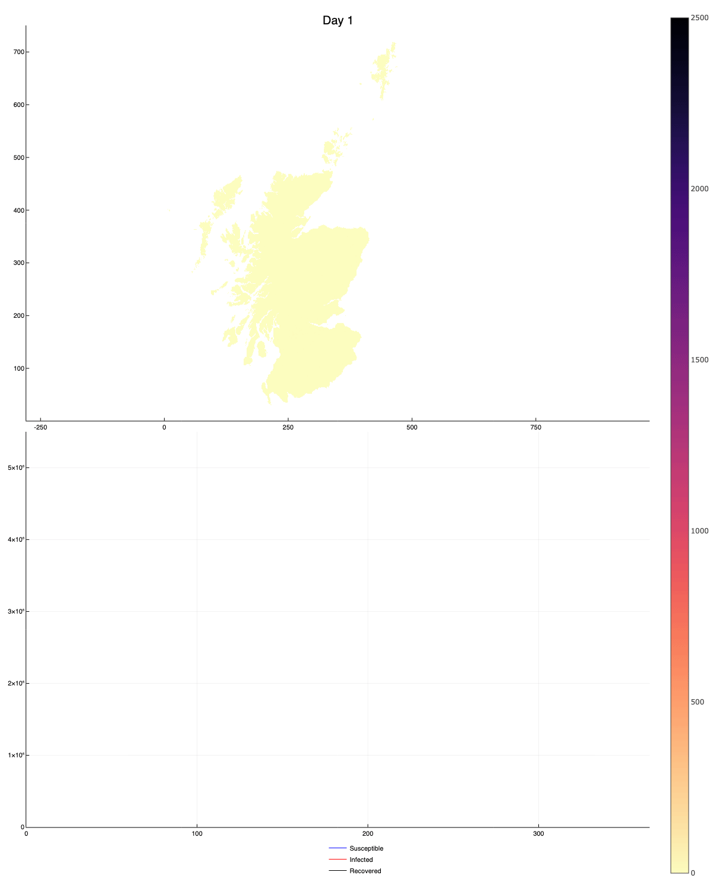

# Simulation

*Package for running dynamic ecosystem and epidemiological simulations*

[![][docs-dev-img]][docs-dev-url] [![][actions-dev-img]][actions-dev-url] [![][codecov-dev-img]][codecov-dev-url]

## Summary

**Simulation** is a [Julia](http://www.julialang.org) package that
provides functionality for simulating species undergoing dynamic
biological processes such as birth, death, competition and dispersal, as well as environmental changes in climate and habitat. This branch has now been adapted to include basic functionality for spatially explicit, dynamic, stochastic SIR models.

Examples for running small test SIR simulations and scaled up versions (UK and Scotland sized) are available in `examples/Epidemiology`. Documentation of model structure can be found [here](docs/Structure_gh.md) and ideas for model development [here](docs/Design.md).

The package was primarily developed for global scale simulations of
plant biodiversity. The underlying model for this is described in the arXiv paper [arXiv:1911.12257 (q-bio.QM)][paper-url],
*Dynamic virtual ecosystems as a tool for detecting large-scale responses of biodiversity to environmental and land-use change*. Future updates to the package functionality involve incorporating
age-structure and more complex epidemiological models.

This package is in alpha now, so please raise an issue if you find any
problems.

[paper-url]: https://arxiv.org/abs/1911.12257

[docs-dev-img]: https://img.shields.io/badge/docs-dev-blue.svg
[docs-dev-url]: https://ScottishCovidResponse.github.io/Simulation.jl/dev
[travis-dev-img]: https://travis-ci.org/ScottishCovidResponse/Simulation.jl.svg?branch=dev
[travis-dev-url]: https://travis-ci.org/ScottishCovidResponse/Simulation.jl?branch=dev

[actions-dev-img]: https://github.com/ScottishCovidResponse/Simulation.jl/workflows/Simulation%20testing/badge.svg
[actions-dev-url]: https://github.com/ScottishCovidResponse/Simulation.jl/actions
[codecov-dev-img]: https://codecov.io/gh/ScottishCovidResponse/Simulation.jl/branch/dev/graph/badge.svg
[codecov-dev-url]: https://codecov.io/gh/ScottishCovidResponse/Simulation.jl?branch=dev
