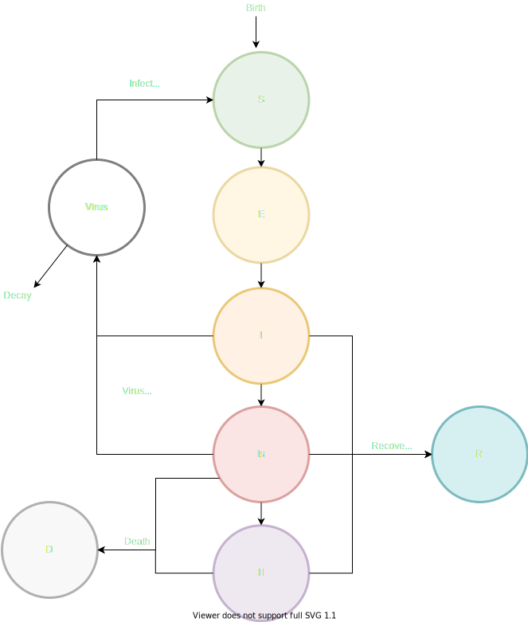

# Model development

*Description of the model as it currently stands.*

## Epidemiology

* We currently have an SEI2HRD compartmental model: Susceptible-Exposed-Asymptomatic-Symptomatic-Hospitalised-Recovered-Dead, as seen in Figure 1 below.

### Virus update loop
* Virus grows as the sum of several Binomal draws from each infection category,  ~  where  is new virus,  is the current grid square,  is the disease class, and  is the probability of virus generation per disease class.
* The probability of generating virus is dependent on the population size of that disease class (), the growth parameter of that disease class (), and the match of the virus to the environment at that location (): 
* The virus decays similarly, according to a set probability  and the inverse match with environment (): Decayed virus ~ 
* The newly generated virus is distributed in space (i.e. grid square ) via a Gaussian kernel:  where  is a gaussian kernel per infection class.
* Currently, only the symptomatic and asymptomatic infectious classes can generate and spread virus, and  for all others.
* Newly generated virus infects other susceptibles either as an instantaneous force of infection (e.g. aerosol transmission) or through environmental transmission (e.g. through contact with a surface), both at separate rates. See below for more details.

### Disease class update loop
* Birth/death per class: Susceptibles are born into the population at a set probability per class. There is also a background probability of death from each disease class.
  *  ~ 
  *  ~ 
* Transitions per class: transitions between disease classes happen according to a transition matrix , which are calculated as moves into the disease class from other categories:  where  number of classes.
*  is constructed in advance and is altered for movement from Susceptible to Exposed categories by the amount of virus available in that location, , or the instantaneous force of infection, , which disappears at the end of each step.

*Figure 1: Current model structure.*

## Code Structure

* The virus update loop happens first, parallelised over disease category. The virus must move between locations, so each process must have full access to the entire space. This will parallelise better when we have more disease categories, like age.
* The disease class update loop happens second, parallelised over space. There is no movement between locations, but instead transitions between different categories.
* An overall matrix housing the abundances per grid square and per disease category is housed in the `EpiSystem`, along with information on environment and a lookup table of moves between different grid squares for each kernel.
* At every iteration of the update step, this matrix is updated in place to avoid additional memory allocation.
