# EcoSISTEM type architecture

The Julia type hierarchy of EcoSISTEM, split into one UML class diagram per
subsystem. `<|--` is inheritance (Julia `<:`) and `*--` is composition (a struct
field). Type parameters are shown in `<…>` (Mermaid generic notation); their bounds
(e.g. `C <: Number`) are given in the source and summarised in the Notes.

The core idea of the current design is the **layer**: a grid of values tagged with two
orthogonal phantom markers — a [`Role`](#layers-roles--niche-axes) (how it is *used*:
a `Condition` matched to tolerances vs a `Resource` consumed) and a `NicheAxis` (*what* it measures, e.g.
`Temperature`). A layer and its matching trait share the same `NicheAxis`, so
"same axis" — not "same unit" — is the matching rule. The `ContinuousRegime`/`*Supply`
type families are **aliases** over one `AbstractLayer{R, A}` hierarchy.

Start with **Composition** for the big picture, then **Layers, roles & niche axes** for
the core abstraction, then the per-subsystem hierarchies.

## Composition — how an `Ecosystem` is assembled

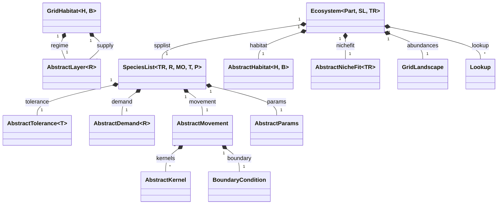

## Top level — ecosystem, abiotic environment, species list

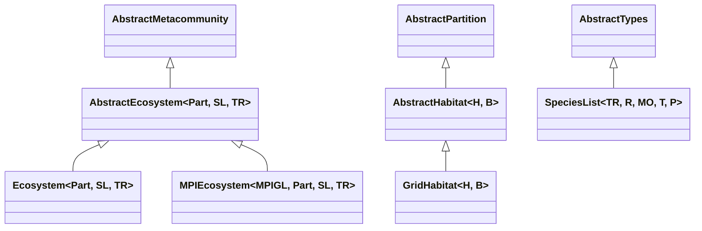

## Layers, roles & niche axes

A materialised layer is a value `matrix` (+ optional `time`) tagged with a `Role` and a
`NicheAxis`. `ContinuousLayer` carries its array rank in the `Arr` parameter (a `Matrix`
is static, a 3-D array is a monthly time series). `DiscreteLayer` is always a `Condition`.

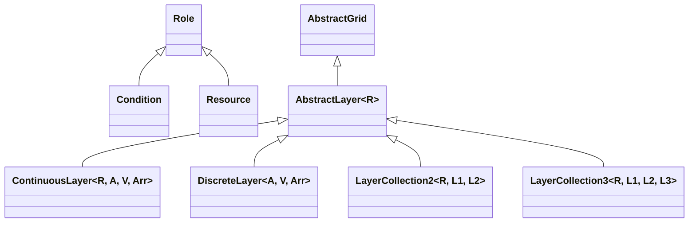

The `NicheAxis` catalogue (what a layer/trait measures). Two abstract groups collect the
WorldClim/CHELSA-style bioclim axes; the rest are direct singletons. `Unclassified` is the
default for a layer built without a declared axis.

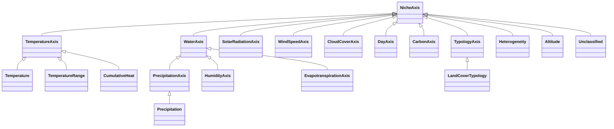

Each axis answers a small interface (defaulted, overridden per group) — `canonicalunit`
(e.g. temperature → `K`, precipitation → `mm`, altitude → `m`), `dynamics` (the
per-timestep change function, e.g. temperature → `TempChange`), and `supplytype` /
`demandtype`. `canonicalunit` also has a `(::Type{<:Role}, ::NicheAxis)` overload: a
`Condition`-role reading of an axis (a niche tolerance, a descriptive climatological normal) and
a `Resource`-role reading of the *same* axis (a literal consumption rate) are legitimately
different physical questions, not the same value with a time unit bolted on — e.g. `Precipitation`
is `mm` as a `Condition` but `L/day` as a `Resource`. The 1-arg form remains the default for any
role/axis without a specific override. See the Notes for the full catalogue.

## Regime & supply aliases

The `*Regime` and `*Supply` names are `const` aliases over `AbstractLayer` — a regime is a
`Condition`-role layer, a supply a `Resource`-role one. `AbstractRegime = AbstractLayer{Condition}`
and `AbstractSupply = AbstractLayer{Resource}`; `SimpleSupply` (free energy) is the only
`Unclassified` supply.

| Alias | Underlying type |
| --- | --- |
| `ContinuousRegime{C}` | `ContinuousLayer{Condition, A, C, Matrix{C}}` (static) |
| `ContinuousTimeRegime{C, M}` | `ContinuousLayer{Condition, A, C, M<:AbstractArray{C,3}}` (monthly) |
| `DiscreteRegime{D}` | `DiscreteLayer{A, D, Matrix{D}}` |
| `RegimeCollection2/3` | `LayerCollection2/3{Condition, …}` |
| `SimpleSupply` | `ContinuousLayer{Resource, Unclassified, typeof(1.0/day), …}` |
| `SolarSupply` / `SolarTimeSupply` | `ContinuousLayer{Resource, SolarRadiation, typeof(1.0kJ/day), …}` (2-D / 3-D) |
| `WaterSupply` / `WaterTimeSupply` | `ContinuousLayer{Resource, Precipitation, typeof(1.0L/day), …}` |
| `AbstractTimeSupply` | `ContinuousLayer{Resource, A, V, Arr<:AbstractArray{V,3}}` |
| `SupplyCollection2` | `LayerCollection2{Resource, …}` |

## Tolerances

A continuous tolerance is a [`NicheTolerance`](#tolerances): one built response distribution per species on
a `NicheAxis` `A` (any `Distributions.ContinuousUnivariateDistribution`, evaluated in the
support frame `C`). `TempTolerance`/`RainTolerance` are aliases of `NicheTolerance`.

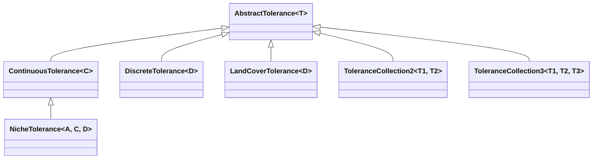

## Tolerance–regime fit

`NicheSuitability` is the general nichefit — the density of a `NicheTolerance`'s distribution at the
(unit-stripped) regime value.

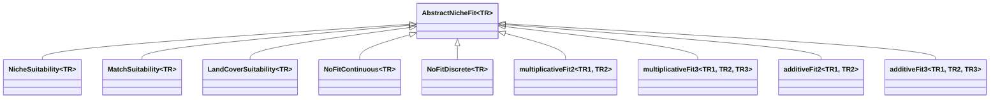

## Layer specs (build-time recipes)

A **spec** describes *how to produce* a layer without holding any grid data;
`materialise(spec, dim, size)` turns it into an `AbstractLayer` on a given grid. Specs are
build-time only (used by `build_environment`/`build_species`/`build_ecosystem`) and never
appear in the simulation hot loop.

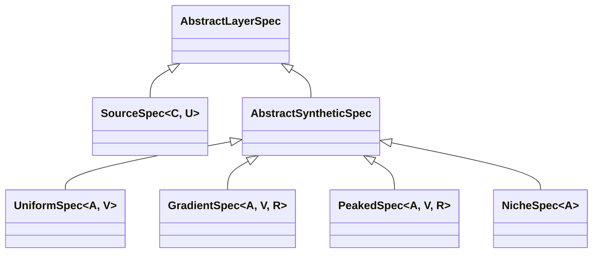

## Demands

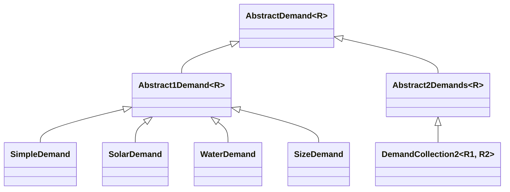

## Movement, kernels & boundaries

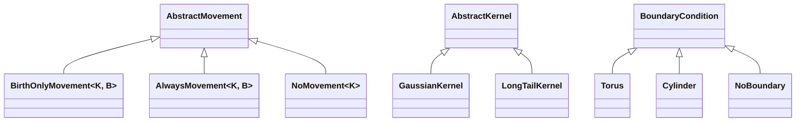

## Population dynamics & scenarios

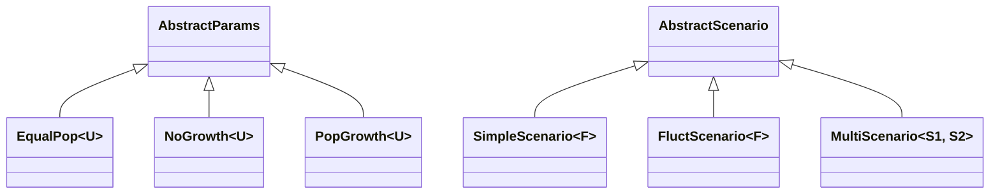

## Climate data (`EcoSISTEM.ClimatePref`)

Readers produce `AxisArray`-backed climate objects. `ClimateRaster{R, A}` is the unified
RasterDataSources-backed type; `ERA`/`CERA`/`CRUTS`/`Reference` remain for their data
sources.

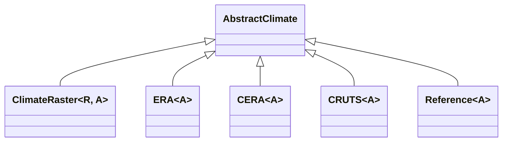

## Notes

- **External supertypes:** `AbstractHabitat <: Diversity.AbstractPartition`,
  `AbstractLayer <: EcoBase.AbstractGrid`, `SpeciesList <: Diversity.AbstractTypes`,
  `AbstractEcosystem <: Diversity.AbstractMetacommunity`.
- **Roles & axes:** `Role ∈ {Condition, Resource}`. Niche axes are grouped under `XxxAxis`
  supertypes: `TemperatureAxis` (`Temperature`, `TemperatureRange`, `TemperatureSeasonality`,
  `CumulativeHeat`, `Isothermality`, `FrostChangeFrequency`); `WaterAxis` → `PrecipitationAxis`
  (`Precipitation`, `PrecipitationSeasonality`), `HumidityAxis` (`VaporPressure`,
  `VaporPressureDeficit`(`Range`), `RelativeHumidity`(`Range`)), `EvapotranspirationAxis`,
  `ClimateMoistureAxis`, plus the `SnowWaterEquivalent`/`SiteWaterBalance`/`GrowingSeasonPrecipitation`
  leaves; `SolarRadiationAxis`, `WindSpeedAxis`, `CloudCoverAxis` (each level + `…Range`); `DayAxis`
  (`DayOfYear`, `DayRange`); `CarbonAxis` (`CarbonFlux`); `TypologyAxis` (`LandCoverTypology`,
  `ClimateTypology`); the singletons `Heterogeneity`, `Altitude`; and the default `Unclassified` —
  extend with `struct MyAxis <: NicheAxis end`. Level axes carry a `canonicalunit` (temperature `K`,
  precipitation `mm`) that a layer's actual-unit values are converted to at build time; a
  `canonicalunit(::Type{<:Role}, ::NicheAxis)` overload gives the `Resource`-role rate form for the
  same axis where one is defined (e.g. `Precipitation` → `L/day`, `SolarRadiation` → `kJ/day`).
- **Layer aliases:** `AbstractRegime = AbstractLayer{Condition}`,
  `AbstractSupply = AbstractLayer{Resource}`. `ContinuousRegime`/`ContinuousTimeRegime`/`DiscreteRegime`/
  `RegimeCollection2,3` and `Simple`/`Solar`/`Water`(`Time`)`Supply`/
  `SupplyCollection2` are all `const` aliases over `ContinuousLayer`/`DiscreteLayer`/
  `LayerCollection`.
- `NicheSuitability` evaluates a `NicheTolerance`'s stored `Distributions.ContinuousUnivariateDistribution`
  (which may be the package's own `Trapezoid{T <: Real}`) at the regime value.
- `MPIEcosystem` and the MPI landscape types live in the `EcoSISTEMMPIExt`
  weak-dependency extension; the `AbstractClimate` subtypes are in the
  `EcoSISTEM.ClimatePref` submodule.
- **Selected parameter bounds (from the source):**
  `AbstractLayer{R <: Role}`,
  `ContinuousLayer{R <: Role, A <: NicheAxis, V <: Number, Arr <: AbstractArray{V}}`,
  `DiscreteLayer{A <: NicheAxis, V, Arr <: AbstractArray{V}}`,
  `AbstractHabitat{H <: AbstractRegime, B <: AbstractSupply}`,
  `NicheTolerance{A <: NicheAxis, C, D}` with `ContinuousTolerance{C <: Number}`,
  `EqualPop{U <: Unitful.Units}`, `ClimateRaster{R <: RasterDataSource, A <: AxisArray}`,
  `SpeciesList{TR <: AbstractTolerance, R <: AbstractDemand, MO <: AbstractMovement,
  T <: AbstractTypes, P <: AbstractParams}`.
```
