# EcoSISTEM type architecture

The Julia type hierarchy of EcoSISTEM, split into one UML class diagram per subsystem. `<|--` is
inheritance (Julia `<:`) and `*--` is composition (a struct field). Type parameters are shown in
`<...>` (Mermaid generic notation); their bounds (e.g. `C <: Number`) are given in the source and
summarised in the Notes.

The core idea of the current design is the **layer**: a grid of values tagged with two orthogonal
phantom markers - a [`Role`](#layers-roles--niche-axes) (how it is *used*: a `Condition` matched to
tolerances vs a `Resource` consumed) and a `NicheAxis` (*what* it measures, e.g. `Temperature`). A
layer and its matching tolerance share the same `NicheAxis`, so "same axis" - not "same unit" - is
the matching rule. The `ContinuousRegime`/`Supply{A}` names are **aliases** over one
`AbstractLayer{R, A}` hierarchy.

**A recurring shape, worth recognising once.** Wherever an option comes from a fixed vocabulary,
it is a **type**, not a `Symbol` - an `AbstractSchedule`, an `AbstractSeriesEnd`, an
`AbstractChangeMode`. Two things follow: a wrong value is rejected by the signature at the call site
where it was written, and each case is dispatchable, so the behaviours behind it are separate
methods rather than a branch retaken on every call. Several hierarchies below exist only for that.

**Every abstract type below is `public`, not exported.** A supertype is what you dispatch on,
subtype or annotate a field with - reached when extending the package, not when using it - so it is
supported and documented but kept out of the `using EcoSISTEM` namespace, where the concrete
**leaves** live. Write `EcoSISTEM.AbstractLayer`, or name it in your `using`. The two exceptions are
`MPIEcosystem` and `MPIGridLandscape`, which are abstract only because their concrete subtypes live
in the MPI extension.

Start with **Composition** for the big picture, then **Layers, roles & niche axes** for the core
abstraction, then the per-subsystem hierarchies.

## Composition - how an `Ecosystem` is assembled

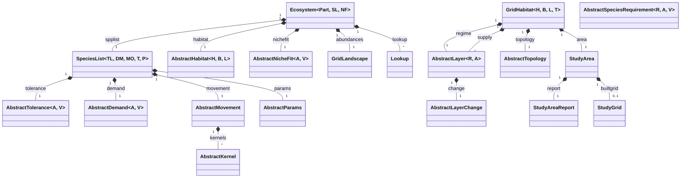
```mermaid
classDiagram
    class Ecosystem~Part, SL, NF~
    class SpeciesList~TL, DM, MO, T, P~
    class GridHabitat~H, B, L, T~
    class AbstractHabitat~H, B, L~
    class AbstractLayer~R, A~
    class AbstractSpeciesRequirement~R, A, V~
    class AbstractTolerance~A, V~
    class AbstractDemand~A, V~
    class AbstractNicheFit~A, V~

    Ecosystem "1" *-- "1" SpeciesList : spplist
    Ecosystem "1" *-- "1" AbstractHabitat : habitat
    Ecosystem "1" *-- "1" AbstractNicheFit : nichefit
    Ecosystem "1" *-- "1" GridLandscape : abundances
    Ecosystem "1" *-- "*" Lookup : lookup

    GridHabitat "1" *-- "1" AbstractLayer : regime
    GridHabitat "1" *-- "1" AbstractLayer : supply

    SpeciesList "1" *-- "1" AbstractTolerance : tolerance
    SpeciesList "1" *-- "1" AbstractDemand : demand
    SpeciesList "1" *-- "1" AbstractMovement : movement
    SpeciesList "1" *-- "1" AbstractParams : params

    AbstractMovement "1" *-- "*" AbstractKernel : kernels
    GridHabitat "1" *-- "1" AbstractTopology : topology
    GridHabitat "1" *-- "1" StudyArea : area
    StudyArea "1" *-- "1" StudyAreaReport : report
    StudyArea "1" *-- "0..1" StudyGrid : builtgrid

    AbstractLayer "1" *-- "1" AbstractLayerChange : change
```

The last line is the one that is easy to miss: **change belongs to the layer**, not to the
ecosystem or the axis. A layer that varies in time is not a separate type - it holds the values
current *now* plus a rule for how they move.

`GridLandscape` holds the abundances as both a flat `matrix` (species × location) and a `grid`
(species × Y × X) *view of the same memory*. Dimension order is `(y, x)` **everywhere**, and only a
non-square grid exposes a mix-up - so every grid fixture should be non-square.

## Top level - ecosystem, abiotic environment, species list

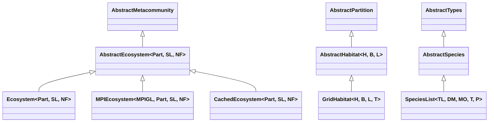
```mermaid
classDiagram
    class AbstractEcosystem~Part, SL, NF~
    class Ecosystem~Part, SL, NF~
    class MPIEcosystem~MPIGL, Part, SL, NF~
    class CachedEcosystem~Part, SL, NF~
    class AbstractHabitat~H, B, L~
    class GridHabitat~H, B, L, T~
    class SpeciesList~TL, DM, MO, T, P~
    AbstractMetacommunity <|-- AbstractEcosystem
    AbstractEcosystem <|-- Ecosystem
    AbstractEcosystem <|-- MPIEcosystem
    AbstractEcosystem <|-- CachedEcosystem
    AbstractPartition <|-- AbstractHabitat
    AbstractHabitat   <|-- GridHabitat
    AbstractTypes <|-- AbstractSpecies
    AbstractSpecies <|-- SpeciesList
```

**`AbstractSpecies` sits between Diversity's `AbstractTypes` and `SpeciesList`, and it is where the
forwarding contract is stated.** `AbstractTypes` means *"things with a similarity structure"*, which
says nothing about ecology; an ecosystem needs species that can be paired with an environment axis
for axis, drawn from per species and counted per cell. More practically: a species list **holds**
its similarity structure in a field rather than being one, so every `Diversity.API` hook must
delegate there - and a subtype that forgets is wrong **silently**, because Diversity's defaults are
not neutral. That is the contract `AbstractSpecies` documents, and what a second implementation would
have to honour.
It is also what [`AbstractEcosystem`](@ref)'s `SL` parameter is bounded by, so the ecosystem
commits to the *interface* rather than to `SpeciesList` itself.

An `Ecosystem` *is* a Diversity metacommunity, with one subcommunity per grid cell. **Every** grid
cell, including inactive ones - the `active` mask is not consulted. That costs nothing for the
partitioned measures, which weight each subcommunity by its share of abundance and so give an empty
cell zero weight, but a *subcommunity* measure returns one row per cell, most of them meaningless on
a small island in a large grid.

## Layers, roles & niche axes

A materialised layer is a value `matrix` tagged with a `Role` and a `NicheAxis`. `CategoricalLayer`
is always a `Condition` - a class code is something a species is matched to, never consumed.

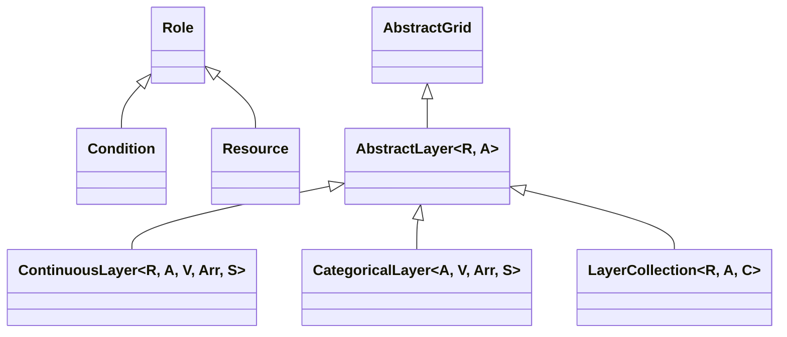
```mermaid
classDiagram
    class Role
    class Condition
    class Resource
    class AbstractLayer~R, A~
    class ContinuousLayer~R, A, V, Arr, S~
    class CategoricalLayer~A, V, Arr, S~
    class LayerCollection~R, A, C~
    Role <|-- Condition
    Role <|-- Resource
    AbstractGrid   <|-- AbstractLayer
    AbstractLayer  <|-- ContinuousLayer
    AbstractLayer  <|-- CategoricalLayer
    AbstractLayer  <|-- LayerCollection
```

A `LayerCollection` holds several layers of one role over one grid, backed by a `NamedTuple` whose
names come from the members' own niche axes (`(Temperature = ..., Precipitation = ...)`). Arity is
whatever the caller writes; the names and every member's concrete type live in `C`, so agreement
between two collections is a compile-time comparison.

Members are reached through the **standard container interface** - `lc.Precipitation`, `lc[1]`,
`lc[:Precipitation]`, `keys`, `values`, `pairs`, `iterate`, `length`, `merge`, `NamedTuple(lc)` -
forwarded to that backing (`src/collections.jl`). A **single layer implements the same interface as a
one-member container**, so nothing downstream has to know whether it holds one or several. The same
shape serves `SpeciesRequirementCollection` and `CombiningFit`; `src/Collections.jl` holds what is
common to all three.

`eltype` is deliberately **not** part of it: on a leaf it is the unit frame the data is in (and
what supplies a nichefit's frame parameter), and a collection's members may differ, so it is asked of
each member - `map(eltype, values(lc))`.

`SpeciesRequirementCollection` is the species-side mirror of `LayerCollection`, and both **read the
role off their members** rather than taking it - so neither can be tagged with a role its own members
contradict, and a collection mixing the two roles is refused.

**Regimes and supplies have no arity relationship.** An environment may have two regimes and one
supply, or the reverse; each supply is resolved against the whole regime. Do not assume they pair up.

### The niche axis catalogue

What a layer or tolerance *measures*. Grouping supertypes (`XxxAxis`) collect the related
WorldClim/CHELSA-style bioclim variables; the rest are direct singletons. `NicheAxis` is the
default for a layer built without a declared axis.


```mermaid
classDiagram
    class NicheAxis
    NicheAxis <|-- TemperatureAxis
    NicheAxis <|-- WaterAxis
    NicheAxis <|-- SolarRadiationAxis
    NicheAxis <|-- WindSpeedAxis
    NicheAxis <|-- CloudCoverAxis
    NicheAxis <|-- DayAxis
    NicheAxis <|-- CarbonAxis
    NicheAxis <|-- TypologyAxis
    NicheAxis <|-- SpaceAxis
    NicheAxis <|-- Heterogeneity
    NicheAxis <|-- Altitude
    TemperatureAxis <|-- Temperature
    TemperatureAxis <|-- TemperatureRange
    TemperatureAxis <|-- TemperatureSeasonality
    TemperatureAxis <|-- CumulativeHeat
    TemperatureAxis <|-- Isothermality
    TemperatureAxis <|-- FrostChangeFrequency
    WaterAxis <|-- PrecipitationAxis
    WaterAxis <|-- HumidityAxis
    WaterAxis <|-- EvapotranspirationAxis
    WaterAxis <|-- ClimateMoistureAxis
    WaterAxis <|-- SnowWaterEquivalent
    WaterAxis <|-- SiteWaterBalance
    WaterAxis <|-- GrowingSeasonPrecipitation
    PrecipitationAxis <|-- Precipitation
    PrecipitationAxis <|-- PrecipitationSeasonality
    HumidityAxis <|-- VapourPressure
    HumidityAxis <|-- VapourPressureDeficitAxis
    HumidityAxis <|-- RelativeHumidityAxis
    VapourPressureDeficitAxis <|-- VapourPressureDeficit
    VapourPressureDeficitAxis <|-- VapourPressureDeficitRange
    RelativeHumidityAxis <|-- RelativeHumidity
    RelativeHumidityAxis <|-- RelativeHumidityRange
    EvapotranspirationAxis <|-- Evapotranspiration
    EvapotranspirationAxis <|-- EvapotranspirationRange
    ClimateMoistureAxis <|-- ClimateMoisture
    ClimateMoistureAxis <|-- ClimateMoistureRange
    SolarRadiationAxis <|-- SolarRadiation
    SolarRadiationAxis <|-- SolarRadiationRange
    WindSpeedAxis <|-- WindSpeed
    WindSpeedAxis <|-- WindSpeedRange
    CloudCoverAxis <|-- CloudCover
    CloudCoverAxis <|-- CloudCoverRange
    DayAxis <|-- DayOfYear
    DayAxis <|-- DayCount
    CarbonAxis <|-- CarbonFlux
    TypologyAxis <|-- LandCoverTypology
    TypologyAxis <|-- ClimateTypology
    SpaceAxis <|-- SurfaceArea
```

Each axis answers a small interface (defaulted, overridden per group) - `canonicalunit` and
`supplytype`/`demandtype`. **The grouping is by physical quantity, so the name must surface a unit
difference**: `RelativeHumidity` (a percentage) and `VapourPressureDeficit` (a pressure) are separate
groups under `HumidityAxis` precisely because they are not interconvertible.

`canonicalunit` also has a `(::Type{<:Role}, ::NicheAxis)` overload. A `Condition`-role reading of an
axis (a niche tolerance, a descriptive climatological normal) and a `Resource`-role reading of the
*same* axis (a literal consumption rate) are legitimately different physical questions, not the same
value with a time unit bolted on - `Precipitation` is `mm/day` as a `Condition` but `L/day` as a
`Resource`. The 1-arg form is the default for any role/axis without a specific override.

## Regime & supply aliases

The `*Regime` names and `Supply` are `const` aliases over `AbstractLayer` - a regime is a
`Condition`-role layer, a supply a `Resource`-role one. `AbstractRegime = AbstractLayer{Condition}`
and `AbstractSupply = AbstractLayer{Resource}`.

| Alias | Underlying type |
| --- | --- |
| `ContinuousRegime{C}` | `ContinuousLayer{Condition, A, C, Matrix{C}}` |
| `CategoricalRegime{D}` | `CategoricalLayer{A, D, Matrix{D}}` |
| `Supply{A}` | `ContinuousLayer{Resource, A, V, ...}`, with `V` free |

**There is one supply name, parameterised by its axis** - `Supply{SolarRadiation}` (`kJ/day` per
cell), `Supply{Precipitation}` (`L/day`), `Supply{CarbonFlux}` (`g/day`), `Supply{SurfaceArea}` (`m^2`,
asked for with [`SurfaceSpec`](@ref)). The last is the only resource that is a **stock** rather
than a flow - a fraction of ground, not a rate - which the model needs nothing special for, since
supplies are recomputed in full each step rather than depleted. **Demands mirror it exactly**:
`Demand{A}`, one type parameterised by the same axes, in the same units. It leaves the *value* type
free on purpose: `canonicalunit(Resource, A)` is the single statement of what a supply is measured
in, so pinning it in the type as well would restate it. There are deliberately no per-resource
aliases and no free/dimensionless supply - a supply whose meaning could come only from its unit is
exactly what this design excludes.

Every layer is `(Y, X)`. A layer that varies in time is not a different type: it holds the values
current now and carries a [`SeriesLayerChange`](#layer-change--how-a-layer-moves-through-time) over
the stored stack, which decides from elapsed time which slice that is.

## Layer change - how a layer moves through time

An axis deliberately does **not** decide how a layer changes. It once did, via a
`dynamics(::NicheAxis)` returning a per-timestep function (temperature -> `TempChange`), but that
coupled two independent questions: an axis fixes what a layer *means*, and so its unit, while whether
a particular layer drifts, oscillates or stays put is a property of that layer's declaration.

**A layer change is a pure function of elapsed time.** That is a requirement, not a convenience:
layers are updated redundantly on every MPI rank, so anything stochastic or ecosystem-dependent here
would silently diverge between ranks. Anything that must mutate the *ecosystem* is an
[intervention](#interventions--changing-the-ecosystem) instead.

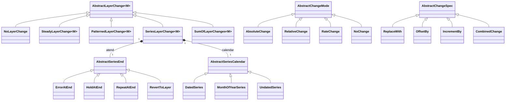
```mermaid
classDiagram
    class AbstractLayerChange~M~
    class NoLayerChange
    class SteadyLayerChange~M~
    class PatternedLayerChange~M~
    class SeriesLayerChange~M~
    class SumOfLayerChanges~M~
    class AbstractChangeMode
    class AbstractChangeSpec
    class AbstractSeriesEnd
    class AbstractSeriesCalendar
    AbstractLayerChange <|-- NoLayerChange
    AbstractLayerChange <|-- SteadyLayerChange
    AbstractLayerChange <|-- PatternedLayerChange
    AbstractLayerChange <|-- SeriesLayerChange
    AbstractLayerChange <|-- SumOfLayerChanges
    AbstractChangeMode <|-- AbsoluteChange
    AbstractChangeMode <|-- RelativeChange
    AbstractChangeMode <|-- RateChange
    AbstractChangeMode <|-- NoChange
    AbstractChangeSpec <|-- ReplaceWith
    AbstractChangeSpec <|-- OffsetBy
    AbstractChangeSpec <|-- IncrementBy
    AbstractChangeSpec <|-- CombinedChange
    AbstractSeriesEnd <|-- ErrorAtEnd
    AbstractSeriesEnd <|-- HoldAtEnd
    AbstractSeriesEnd <|-- RepeatAtEnd
    AbstractSeriesEnd <|-- RevertToLayer
    AbstractSeriesCalendar <|-- DatedSeries
    AbstractSeriesCalendar <|-- MonthOfYearSeries
    AbstractSeriesCalendar <|-- UndatedSeries
    SeriesLayerChange "1" *-- "1" AbstractSeriesEnd : atend
    SeriesLayerChange "1" *-- "1" AbstractSeriesCalendar : calendar
```

Three hierarchies meet here, and they answer different questions:

- **`AbstractChangeMode`** - *what kind of quantity* the change carries, which is what decides its
  unit. `AbsoluteChange` is a **position** in the layer's own unit, `RelativeChange` an **interval**
  from the layer's values as captured when the change was attached, `RateChange` an interval per unit
  time, and `NoChange` marks a change carrying no values in the layer's unit at all. Not cosmetic:
  a temperature is a position but a *change* in temperature is a width, so a relative change on a
  `°C` layer must be read in `K` - Unitful rejects adding two affine positions outright. Because the
  mode lives in the supertype, applying a change dispatches on it once, whatever shape produced the
  value.
- **`AbstractChangeSpec`** - *how the value is combined* with what is already there.
  `ReplaceWith` overwrites, `OffsetBy` adds a fixed displacement, `IncrementBy` accumulates a rate,
  and `CombinedChange` composes several. Under `ReplaceWith` the underlying layer's **values** are
  irrelevant - what the spec still supplies is the axis (and so the unit), the value's dimension, and
  the grid.
- **`AbstractSeriesEnd` / `AbstractSeriesCalendar`** - what a stored series does past its last slice
  (`atend`), and what its time coordinates *mean* (`calendar`). A `DatedSeries` carries real dates, a
  `MonthOfYearSeries` a repeating climatology keyed by calendar month number, an `UndatedSeries` bare
  offsets from an origin.

**A stored series is indexed by elapsed time, never by a step counter.** That is what makes the
model timestep-independent: twelve one-month steps and one twelve-month step land on the same slice.
A cursor advanced once per call cannot do this, which is why one is not used.


A change is **declared** by wrapping a spec in `Varying` at the `GridHabitat` boundary:

```julia
GridHabitat(regime = Varying(SourceSpec(WorldClim{BioClim}, :bio1),
                                   IncrementBy(0.02K/yr)),
                  supply = GradientSpec(...), area = area)
```

Specs themselves stay naked - no spec type carries a change - because a change is meaningless until
there is a grid: it is validated against the layer's unit, and a relative change captures the layer's
values, neither of which exists until the spec has been materialised. So `StudyArea`, whose whole job
is deciding the grid, unwraps and ignores the wrapper, and the same spec can be handed to both
without the two drifting apart. Each layer names its own change, so a multi-variable regime wraps its
*elements* rather than the tuple.

## Interventions - changing the ecosystem

A **second, deliberately separate** mechanism, for what happens to the *ecosystem* rather than to one
layer's values. An `Intervention` answers three questions independently - **when**, **where** and
**what** - and an `InterventionSet` holds several.

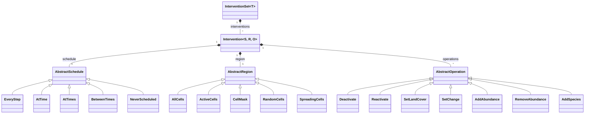
```mermaid
classDiagram
    class Intervention~S, R, O~
    class InterventionSet~T~
    class AbstractSchedule
    class AbstractRegion
    class AbstractOperation
    AbstractSchedule <|-- EveryStep
    AbstractSchedule <|-- AtTime
    AbstractSchedule <|-- AtTimes
    AbstractSchedule <|-- BetweenTimes
    AbstractSchedule <|-- NeverScheduled
    AbstractRegion <|-- AllCells
    AbstractRegion <|-- ActiveCells
    AbstractRegion <|-- CellMask
    AbstractRegion <|-- RandomCells
    AbstractRegion <|-- SpreadingCells
    AbstractOperation <|-- Deactivate
    AbstractOperation <|-- Reactivate
    AbstractOperation <|-- SetLandCover
    AbstractOperation <|-- SetChange
    AbstractOperation <|-- AddAbundance
    AbstractOperation <|-- RemoveAbundance
    AbstractOperation <|-- AddSpecies
    Intervention "1" *-- "1" AbstractSchedule : schedule
    Intervention "1" *-- "1" AbstractRegion : region
    Intervention "1" *-- "*" AbstractOperation : operations
    InterventionSet "1" *-- "*" Intervention : interventions
```

**Why two mechanisms and not one.** A *layer change* is a pure function of elapsed time, so it can
be applied redundantly on every MPI rank and still agree. An *intervention* mutates the ecosystem -
the active mask, abundances, the species list - so it must be applied once and identically
everywhere. That is also why the operation set is **closed**: a user callback could draw from the
global RNG or write a layer's matrix directly, both of which desynchronise ranks. Selections come
from a counter-based stream, `hash((seed, :intervention, k, step))`, generalising the per-species
scheme.

**`Deactivate` kills what lives in the cell**, and must: a deactivated cell is skipped by the hot
loop, so anything left in it would neither breed nor die. `Reactivate` deliberately does *not*
restock - recolonisation is by dispersal.

**Counts may be exact or rates** - `RandomCells(20)` or `RandomCells(0.05/year)`, drawn
binomially - and **operations after the first share one resolved region**, which is the only way to
act twice on the same random cells (clear ground, then plant it).

## Tolerances

A continuous tolerance is a `NicheTolerance`: one built response distribution per species on a
`NicheAxis` `A` (any `Distributions.ContinuousUnivariateDistribution`, evaluated in the support frame
`V`). `TempTolerance`/`RainTolerance` are aliases of `NicheTolerance`.

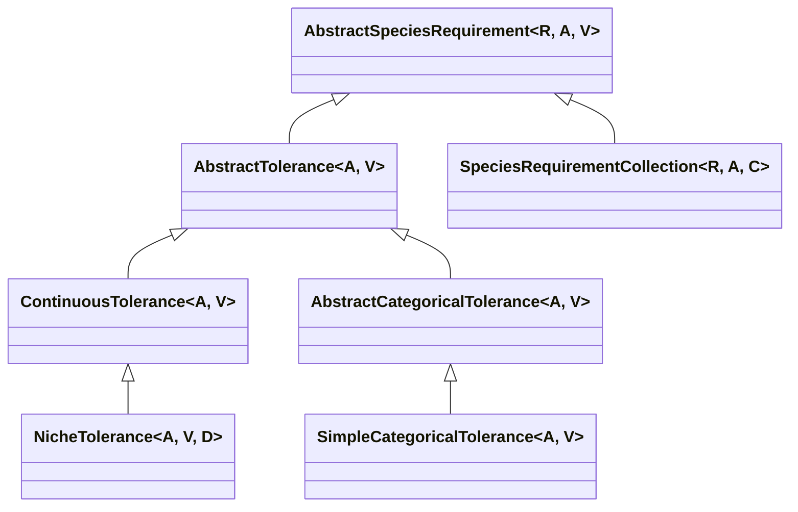
```mermaid
classDiagram
    class AbstractSpeciesRequirement~R, A, V~
    class AbstractTolerance~A, V~
    class ContinuousTolerance~A, V~
    class NicheTolerance~A, V, D~
    class AbstractCategoricalTolerance~A, V~
    class SimpleCategoricalTolerance~A, V~
    class SpeciesRequirementCollection~R, A, C~
    AbstractSpeciesRequirement <|-- AbstractTolerance
    AbstractTolerance  <|-- ContinuousTolerance
    AbstractTolerance  <|-- AbstractCategoricalTolerance
    AbstractSpeciesRequirement <|-- SpeciesRequirementCollection
    ContinuousTolerance <|-- NicheTolerance
    AbstractCategoricalTolerance <|-- SimpleCategoricalTolerance
```

`AbstractTolerance{A, V}` is a **parametric alias** for `AbstractSpeciesRequirement{Condition, A, V}`, so
`<|--` above is an alias relation rather than a separate declaration - but it constrains exactly as a
distinct hierarchy would: a `Demand` is not an `AbstractTolerance`.

**The two branches are the same shape.** On each, the tolerance carries the *whole* response - a
built distribution for a `NicheTolerance`, a set of acceptable classes plus the `penalty` outside them
for a `SimpleCategoricalTolerance` - and the nichefit only evaluates it. `AbstractCategoricalTolerance`
is defined by what it **answers** (the weight species `sp` gets in category `c`), so a future graded
species × category type slots in beside the simple one without moving anything.

Tolerances are built in the axis's canonical unit, so suitability is **unit-invariant**: the same
niche written in mm/day, cm/day and m/day gives identical results.

## Tolerance-regime fit

`NicheSuitability` is the general nichefit - the density of a `NicheTolerance`'s distribution at the
(unit-stripped) regime value.

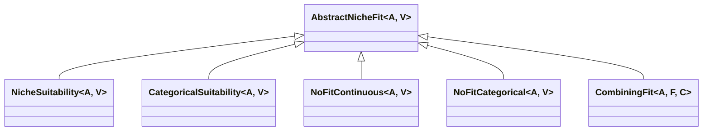
```mermaid
classDiagram
    class AbstractNicheFit~A, V~
    class NicheSuitability~A, V~
    class CategoricalSuitability~A, V~
    class NoFitContinuous~A, V~
    class NoFitCategorical~A, V~
    class CombiningFit~A, F, C~
    AbstractNicheFit <|-- NicheSuitability
    AbstractNicheFit <|-- CategoricalSuitability
    AbstractNicheFit <|-- NoFitContinuous
    AbstractNicheFit <|-- NoFitCategorical
    AbstractNicheFit <|-- CombiningFit
```

`CombiningFit` is the collection of the nichefit family: one fit per layer, plus the function that
combines their per-layer suitabilities. `combine` is handed the whole *`NamedTuple`* of results -
`s -> (s.summer + s.winter) * s.moisture` - rather than being a binary operator folded across them.
`MultiplicativeFit` and `AdditiveFit` are `combine = prod` and `combine = sum`.

**Suitability may legitimately exceed 1.** It is an unnormalised density used as a relative
weight, never a probability - and that is the mechanism delivering a *required* specialist advantage:
a narrow niche concentrates the same unit mass into a taller peak, paid for by faster falloff.
Peak-normalising would leave the specialist strictly dominated by the generalist everywhere.

## Layer specs (build-time recipes)

A **spec** describes *how to produce* a layer without holding any grid data; `materialise(spec,
area)` turns it into a layer on a decided grid. Specs are build-time only (used by
`StudyArea`/`GridHabitat`/`build_species`/`build_ecosystem`) and never appear in the simulation
hot loop.

The root is `AbstractSpec`, split into **lazy** specs (`AbstractLazySpec` - role-flexible, read or
combined at materialise time) and **synthetic** specs (`AbstractSyntheticSpec` - generated from a
rule), the latter further split into layer specs (a regime/supply) and mask specs (a `within` mask).
The `LayerSpec`/`MaskSpec` aliases name the specs valid in each role. Only a lazy spec can shape a
study area: a synthetic one has no CRS, extent or resolution of its own.

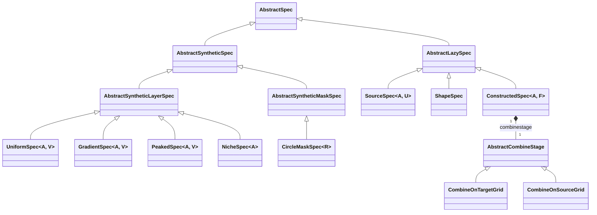
```mermaid
classDiagram
    class AbstractSpec
    class AbstractLazySpec
    class AbstractSyntheticSpec
    class AbstractSyntheticLayerSpec
    class AbstractSyntheticMaskSpec
    class SourceSpec~A, U~
    class ShapeSpec
    class ConstructedSpec~A, F~
    class UniformSpec~A, V~
    class GradientSpec~A, V~
    class PeakedSpec~A, V~
    class NicheSpec~A~
    class CircleMaskSpec~R~
    class AbstractCombineStage
    AbstractSpec              <|-- AbstractLazySpec
    AbstractSpec              <|-- AbstractSyntheticSpec
    AbstractLazySpec          <|-- SourceSpec
    AbstractLazySpec          <|-- ShapeSpec
    AbstractLazySpec          <|-- ConstructedSpec
    AbstractSyntheticSpec     <|-- AbstractSyntheticLayerSpec
    AbstractSyntheticSpec     <|-- AbstractSyntheticMaskSpec
    AbstractSyntheticLayerSpec <|-- UniformSpec
    AbstractSyntheticLayerSpec <|-- GradientSpec
    AbstractSyntheticLayerSpec <|-- PeakedSpec
    AbstractSyntheticLayerSpec <|-- NicheSpec
    AbstractSyntheticMaskSpec  <|-- CircleMaskSpec
    AbstractCombineStage <|-- CombineOnTargetGrid
    AbstractCombineStage <|-- CombineOnSourceGrid
    ConstructedSpec "1" *-- "1" AbstractCombineStage : combinestage
```

Every spec is constructed exactly one way - via its own inner constructor, e.g. `GradientSpec(low,
high; axis)`, `CircleMaskSpec(radius = 4km)`, `ShapeSpec(path)` - with no wrapper functions. A
data-derived layer or a `within` mask beyond a circle/shape is a `ConstructedSpec`: one or more child
data layers plus a combine rule (do-block first). For example, a land-cover mask excluding open
water, using the `landcoverclass` lookup by name:

```julia
ConstructedSpec(EarthEnv{LandCover}, axis = EcoSISTEM.NicheAxis) do lc
    compress_landcover(lc) .!= landcoverclass(:open_water)
end
```

Its `combinestage` says *when* the combine runs. `CombineOnTargetGrid()` (the default) samples every
layer onto the study grid and combines there, which is what keeps the land-cover collapse above
interpolating percentages rather than class codes. `CombineOnSourceGrid()` combines on the layers'
own shared grid and samples the result, which is needed whenever the combine does not commute with
regridding - one that looks beyond its own cell, and equally a cell-wise but **nonlinear** one, since
the ratio of two interpolations is not the interpolation of the ratio. On that path the layers must
share a native grid (checked when they are read), and a declared `valuetype` is consulted *before*
the resample, so a derived class-code layer is taken by nearest class rather than interpolated.

## Named regions - how much of a name to take

A region name almost never denotes one connected piece of ground. "France" includes Guadeloupe and
Martinique, "Norway" includes Bouvet Island in the South Atlantic, and "Chile" includes Easter
Island, so the extent of everything a name covers can be many times the extent of the ground most
people mean by it. A **coverage** says which of the two is wanted.

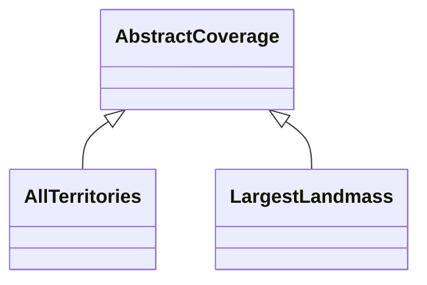
```mermaid
classDiagram
    class AbstractCoverage
    class AllTerritories
    class LargestLandmass
    AbstractCoverage <|-- AllTerritories
    AbstractCoverage <|-- LargestLandmass
```

**Why a type rather than a flag.** The two answers are not two settings of one switch:
`LargestLandmass` carries a count of how many components to keep, and `AllTerritories` has nothing
to count. A `Bool` or a `Symbol` would have to pair the option with a second argument meaningful for
only one of its values, and would be checked somewhere inside rather than at the call site where it
was written. As a type each case owns exactly the fields it means something by, and the choice is
dispatchable, so the two selections are separate methods rather than a branch.

That count is a **keyword**, `LargestLandmass(count = 2)`, where the sibling `RandomCells(20)` takes
its own positionally. The difference is the type name: a plural one lends a bare number something to
attach to, and a singular one does not, so an unnamed number here would read as easily as an
ordinal - the third largest landmass rather than the largest three.

**Largest *component*, not largest *part*.** Components are measured after neighbouring features
have been dissolved together, which is what makes a landmass spanning several countries come out as
one thing: the largest component of a continent is its mainland, where its largest *part* would be
merely its largest country. The same rule delivers France continentale, Great Britain and the
Scottish mainland without an area threshold or a list of exceptions - and it is why there is no
third coverage for "everything but the outliers", which is assembled from these two instead.

It also disposes of the antimeridian for one of the two cases. Natural Earth splits its polygons at
the date line, so no single connected component can cross it and a landmass always has an honest
`West < East`. Only `AllTerritories` can produce a selection spanning the globe - which is where it
is least surprising, since the territory of the United States genuinely does.

**A name is only meaningful with its level.** `NaturalEarthLevel` records which file defines a kind
of region and which of its attributes carries the name, because the same word means different things
at different levels: "Africa" is a grouping of 55 countries at one level and 62 at another, and the
cultural `CONTINENT` "Europe" is a list of whole countries reaching the Pacific where the physical
`Continent` "EUROPE" is a coastline stopping at the Urals. Levels are values in a table rather than
types, since they are read from the source's own vocabulary and nothing dispatches on them.

## Coordinates - places and separations

Two-dimensional quantities come in two kinds, and they are different types on purpose. A **position**
says where something is; a **size** says how far apart two things are. `Spatial2D{Kind, T}` carries
both, with `Kind` pinning which, and the two aliases are what anything else is written against.

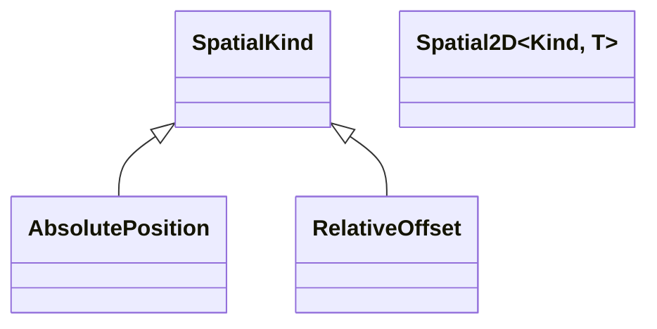
```mermaid
classDiagram
    class SpatialKind
    class AbsolutePosition
    class RelativeOffset
    class Spatial2D~Kind, T~
    SpatialKind <|-- AbsolutePosition
    SpatialKind <|-- RelativeOffset
```

`const SpatialLocation{T} = Spatial2D{AbsolutePosition, T}` and
`const SpatialSize{T} = Spatial2D{RelativeOffset, T}` pin the tag, so a method annotated with one
refuses the other - the same shape as `AbstractRegime`/`AbstractSupply` over `AbstractLayer{Role}`,
and as `AbstractTolerance`/`AbstractDemand` over `AbstractSpeciesRequirement{Role}`.

**Why two types rather than one pair of numbers.** They obey different arithmetic, and the type
system is what enforces it: subtracting two positions gives a size, adding a size to a position
gives a position, sizes add and scale among themselves, and **adding two positions is undefined**
because there is no meaningful answer. A single `(y, x)` tuple can express all four equally well,
including the wrong one.

It also removes a whole class of mistake that this package has hit repeatedly: the two components
are named `y` and `x` and are always in that order, so a pair cannot be built or read back to front.
A bare tuple silently can, and only a non-square grid ever reveals it.

**The units say which frame a value is in**, so no second type has to. A degree quantity makes a
geographic pair, a length quantity a projected one, and only the geographic *position* case has a
range that can be checked without knowing the coordinate reference system - which is exactly where
the construction guard applies and nowhere else. A separation is never range-checked, and is signed:
a displacement may run either way, and an angular separation may exceed the range a latitude is
confined to.

## The study area (deciding the grid)

Choosing the grid is a separate step from building on it. A `StudyArea` resolves a CRS, extent, cell
size and active mask from the layers it is given, plus optional
`within`/`crs`/`cellsize`/`extent`/`align`/`simulate_safely` constraints; `GridHabitat` then
only samples layers onto it. `investigate_study_area` runs the *same* analysis and returns a `StudyAreaReport` instead -
one private `_analyse` serves both, so a report can never describe a grid other than the one that
would be built.

```julia
report = investigate_study_area(regime = cultivated, within = coastline,
                                crs = EPSG(27700), cellsize = 5km)
display(report)                                    # grid, per-layer cost, warnings
area = StudyArea(report, verbosity = :silent)      # commit, reusing its read cache
env  = GridHabitat(regime = cultivated, supply = sunlight, area = area)
```

Two rules carry most of the design. **A layer not named when the area was decided can never move or
resize the grid** - it can only mark cells inactive, and warns when it does, so the area you
inspected is the area you get. And **a layer is kept exactly wherever it can be**: the area aligns to
whichever layer is already in the target CRS, snaps the extent onto that layer's cell boundaries and
crops its grid rather than rebuilding it, so cell registration survives.

Where a grid *is* synthesised, its cells are labelled by their **lower corner** (`Intervals(Start)`,
the convention the package's synthetic grids and layers already used) and it lays down exactly
`ceil(span / cellsize)` of them, starting on the data's own edge - so the grid is flush with the data
rather than straddling it by half a cell. What is left over at the far end fills no cell, and
`simulate_safely` says what becomes of it: by default such a cell is not simulated at all, since
nothing can put data where a file has none, and the grid crops inwards rather than carrying it.
`simulate_safely = false` simulates any cell whose centre has a value - more than half covered - and
says how many, because each is then given a whole cell's worth of supply. The same rule reaches a
layer introduced only at `GridHabitat`: its cells outside the data become missing, and so
inactive.

The report is not prose - every judgement it makes is a **type**, so it can be inspected and tested
rather than parsed:

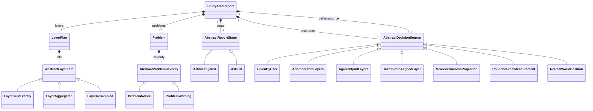
```mermaid
classDiagram
    class StudyAreaReport
    class LayerPlan
    class Problem
    class AbstractDecisionSource
    class AbstractLayerFate
    class AbstractProblemSeverity
    class AbstractReportStage
    AbstractReportStage <|-- AsInvestigated
    AbstractReportStage <|-- AsBuilt
    AbstractDecisionSource <|-- GivenByUser
    AbstractDecisionSource <|-- AdoptedFromLayers
    AbstractDecisionSource <|-- AgreedByAllLayers
    AbstractDecisionSource <|-- TakenFromAlignedLayer
    AbstractDecisionSource <|-- MeasuredAcrossProjection
    AbstractDecisionSource <|-- RoundedFromMeasurement
    AbstractDecisionSource <|-- NoRealWorldPosition
    AbstractLayerFate <|-- LayerKeptExactly
    AbstractLayerFate <|-- LayerAggregated
    AbstractLayerFate <|-- LayerResampled
    AbstractProblemSeverity <|-- ProblemNotice
    AbstractProblemSeverity <|-- ProblemWarning
    StudyAreaReport "1" *-- "1" AbstractDecisionSource : crssource
    StudyAreaReport "1" *-- "1" AbstractDecisionSource : cellsizesource
    StudyAreaReport "1" *-- "*" LayerPlan : layers
    StudyAreaReport "1" *-- "*" Problem : problems
    LayerPlan "1" *-- "1" AbstractLayerFate : fate
    Problem "1" *-- "1" AbstractProblemSeverity : severity
    StudyAreaReport "1" *-- "1" AbstractReportStage : stage
```

**`AbstractReportStage` is what tells an investigated area from a built one**, and it is
load-bearing rather than descriptive: `StudyArea(habitat)` with no other keyword hands back an
`AsBuilt` report *verbatim* rather than re-deriving the grid, because a habitat's grid can be narrower
than the area it was built on - a layer named only to the builder can cost cells, and nothing else
records that.

### `StudyGrid` - where the cells actually are

**A `StudyArea` carries two things, and they answer different questions.** Its `report` records
*how* the grid was decided; its `builtgrid` is a `StudyGrid` saying *where the cells are* - the CRS
and the very `Y`/`X` dimensions the habitat's `active` mask is indexed by, never a second copy of
them. `StudyGrid` is the package's only `EcoBase.AbstractGrid`, so `AbstractHabitat{H, B, L}` passes
it to `AbstractPartition{L}` and anything speaking that interface can ask a habitat where its cells
are.

**`builtgrid` is `nothing` until something has been built on the area, and that is a semantic
guard rather than a data limitation.** An investigated area has a perfectly decided grid - deciding
one is what investigation *is* - but a layer named only to `GridHabitat` can still narrow it, so its
cells are a prediction. Implementing a grid interface on a prediction would claim "these are the
places" when they may not be. Parameterising `StudyArea` on it rather than storing a
`Union{StudyGrid, Nothing}` field keeps the answer concrete: `getcoords(habitat)` infers exactly,
where a bare union field would put a dynamic read into every type built on top.

**`builtgrid` is therefore *not* the same fact as `stage`, and neither derives from the other.**
`StudyArea(habitat)` copies an `AsBuilt` report - it genuinely describes a habitat that exists - into
a *fresh* area that nothing has been built on, so that area is `StudyArea{Nothing}` with an `AsBuilt`
report. The stage describes the report; the parameter describes the area.

**The seven grid methods belong on `StudyGrid`, and must not be put back on `AbstractRegime`.** A
layer holds values **on** a grid: it has no CRS and no origin, so a layer answering them can only
hardcode `xmin`/`ymin` to `0` and reconstruct the cell size as `Float64(size / km)` - which on a
geographic grid gives `1.0 ° km^-1`, neither a length nor an angle, *silently*, with the eventual
`DimensionError` surfacing inside EcoBase's own `xmax` where it reads as the caller's fault. All
three were measured. `StudyGrid` answers from the dimensions instead and returns **unitful** values
in the grid's own units, which needs no change to EcoBase at all - its interface carries no numeric
annotations and its derivations (`xmax`, `xrange`) are plain arithmetic that works on angles
unchanged.

**Cells are named by where they are, lazily.** `placenames` returns a `CellNames` view giving each
cell's half-open extent - `[50.0, 50.5)°N × [0.0, 0.5)°E`, or `[0.0, 1.0) × [1.0, 2.0) km` on a
projected grid, `Y` first as everywhere else. They were stored indices (`"1"`, `"2"`, ...), carrying
nothing a caller could not have counted. Lazy because the eager form costs ~33 MB on a
1.2 million-cell grid against 8 bytes here, on a habitat whose `active` mask was deliberately squeezed
to 0.14 MB; nothing in the simulation reads a cell's name.

**`AbstractDecisionSource` records *why* the grid is what it is** - whether the CRS was given
outright, adopted from the layers, or measured across a projection - so a surprising grid can be
traced to the decision that produced it. **`AbstractLayerFate`** says what the grid cost each layer,
and carries the data each case means something by: `LayerAggregated` holds its whole-number factor,
`LayerResampled` its reason, `LayerKeptExactly` neither.

## Demands

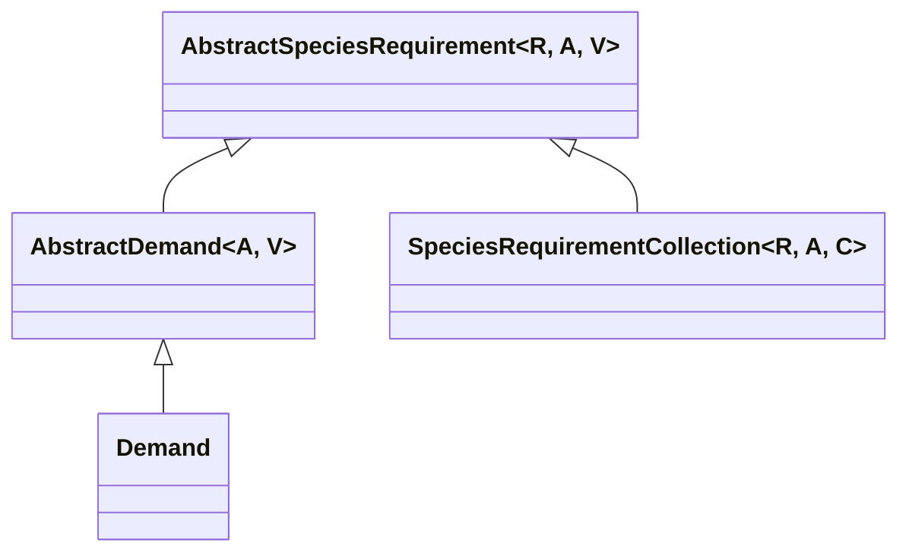
```mermaid
classDiagram
    class AbstractSpeciesRequirement~R, A, V~
    class AbstractDemand~A, V~
    class SpeciesRequirementCollection~R, A, C~
    AbstractSpeciesRequirement <|-- AbstractDemand
    AbstractSpeciesRequirement <|-- SpeciesRequirementCollection
    AbstractDemand   <|-- Demand
```

**The species side mirrors the place side exactly.** `AbstractSpeciesRequirement{R <: Role, A, V}` is to
`SpeciesList` what `AbstractLayer{R, A}` is to `GridHabitat`: `AbstractTolerance` and `AbstractDemand` are
its `Condition` and `Resource` aliases, just as `AbstractRegime` and `AbstractSupply` are
`AbstractLayer`'s.

With several resources the **scarcest binds** - births scale by `min(K/E)` and deaths by
`max(E/K)` across resources (Liebig's law of the minimum), so an abundant resource is correctly
ignored *there*, and only there.

## Movement, kernels & boundaries

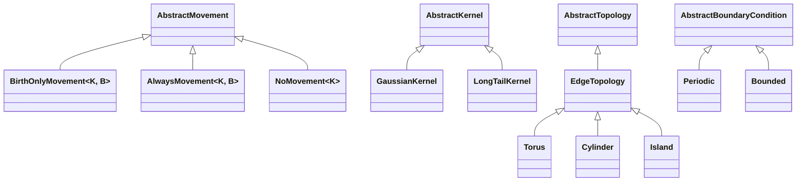
```mermaid
classDiagram
    class BirthOnlyMovement~K, B~
    class AlwaysMovement~K, B~
    class NoMovement~K~
    AbstractMovement  <|-- BirthOnlyMovement
    AbstractMovement  <|-- AlwaysMovement
    AbstractMovement  <|-- NoMovement
    AbstractKernel    <|-- GaussianKernel
    AbstractKernel    <|-- LongTailKernel
    AbstractTopology <|-- EdgeTopology
    EdgeTopology <|-- Torus
    EdgeTopology <|-- Cylinder
    EdgeTopology <|-- Island
    AbstractBoundaryCondition <|-- Periodic
    AbstractBoundaryCondition <|-- Bounded
```

A grid's topology is one [`AbstractBoundaryCondition`](@ref) **per axis** - `EdgeTopology{BCY, BCX}`,
each axis `Periodic` (its edges join) or `Bounded` (they do not). `Torus`, `Cylinder` and `Island` are
aliases for three of the four combinations; the fourth has no name and is written
`EdgeTopology(y = Periodic, x = Bounded)`. `Cylinder` is `{Bounded, Periodic}` - the parameters are
`(y, x)`, and it is **x** that wraps.

The topology belongs to the **grid**, and is set on [`GridHabitat`](@ref) and carried by
[`GridHabitat`](@ref): two species on one grid cannot be on different topologies. Choosing a wrapping
topology on a study area with a real-world position warns that it misstates the geography - except a
`Cylinder` on a grid spanning the whole longitude sweep, where east-west wrapping is exactly right.

What becomes of an individual whose dispersal is aimed at a **dead cell** - off the grid, or an
inactive one - is a separate question and a property of the **disperser**, so `disperse_safely` is one
entry per species on the movement rather than a field of the topology. `true` (the default)
redistributes it among the destinations it can reach, making `Island()` a *reflecting* edge rather
than a lossy one; `false` loses it. That is a real ecological distinction - a wind-dispersed seed
blown out to sea is gone, an animal-dispersed one is carried somewhere reachable - and it applies to a
`Torus` too, which has no edge but may still contain inactive cells.

## Population dynamics

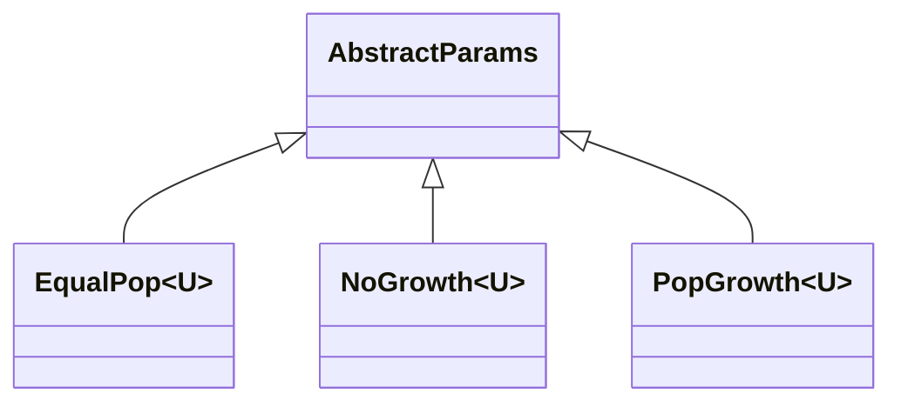
```mermaid
classDiagram
    class EqualPop~U~
    class NoGrowth~U~
    class PopGrowth~U~
    AbstractParams <|-- EqualPop
    AbstractParams <|-- NoGrowth
    AbstractParams <|-- PopGrowth
```

**Regulation is exploitative competition for a shared pool; carrying capacity is emergent rather
than a parameter.** In each cell `E` is the community's *total* demand and `K` the supply; births
scale by `min(K/E, boost)` and deaths by `E/K`. Species therefore interact **only** through `E` -
symmetrically, with no pairwise terms.

**Two orthogonal per-species axes, and the sign structure is the whole design:**

| term | on birth | on death | controls |
| --- | --- | --- | --- |
| `ϵ̄^-longevity` (own demand) | `-longevity` | `-longevity` - **same** | the **tempo** of turnover |
| `ϵ̄real^±survival` (suitability) | `-survival` | `+survival` - **opposite** | the **niche** |

Because the demand term carries the same exponent on both rates it **cancels from the birth/death
ratio**, making a species slow-and-long-lived or fast-and-short-lived without changing where it can
persist. Suitability carries opposite exponents, so it does move the ratio - that is what makes it
the niche.

## Distribution parameters (`src/Dist.jl`)

Building a tolerance from a named distribution means knowing which of its parameters is a location, a
scale and so on - because only some of them carry the axis's unit. `ParamRole` names the four, and
`param_roles` tests which a given `Distributions` family exposes.

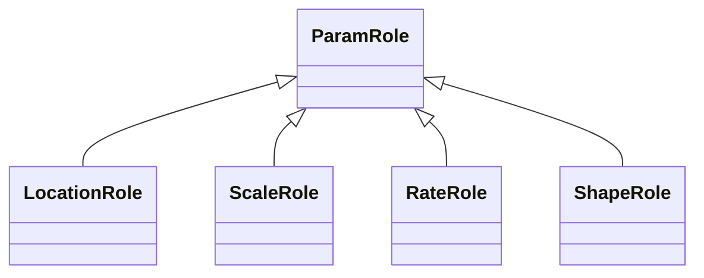
```mermaid
classDiagram
    class ParamRole
    ParamRole <|-- LocationRole
    ParamRole <|-- ScaleRole
    ParamRole <|-- RateRole
    ParamRole <|-- ShapeRole
```

## Climate data

Readers produce `DimensionalData`-backed climate objects (a real `(Y, X[, Ti][, layer])`
`AbstractDimArray`, carrying its own CRS). **`ClimateRaster{S, C, A}` is the only container**: every
reader returns one, and *where the data came from* is its first parameter rather than a type of its
own.

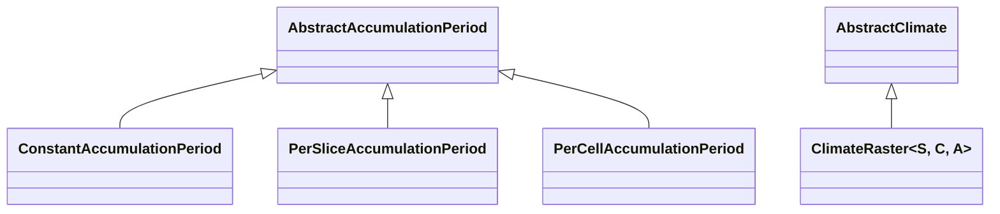
```mermaid
classDiagram
    class ClimateRaster~S, C, A~
    class AbstractAccumulationPeriod
    AbstractClimate <|-- ClimateRaster
    AbstractAccumulationPeriod <|-- ConstantAccumulationPeriod
    AbstractAccumulationPeriod <|-- PerSliceAccumulationPeriod
    AbstractAccumulationPeriod <|-- PerCellAccumulationPeriod
```

### Where the data came from - the source hierarchy

A source is a fieldless marker naming an origin, and it is what a `SourceSpec` accepts. Sources are
of two kinds and the package owns only the second: a **RasterDataSources dataset**
(`WorldClim{BioClim}`, `EarthEnv{LandCover}`, ...), or an `EcoSISTEMSource`.

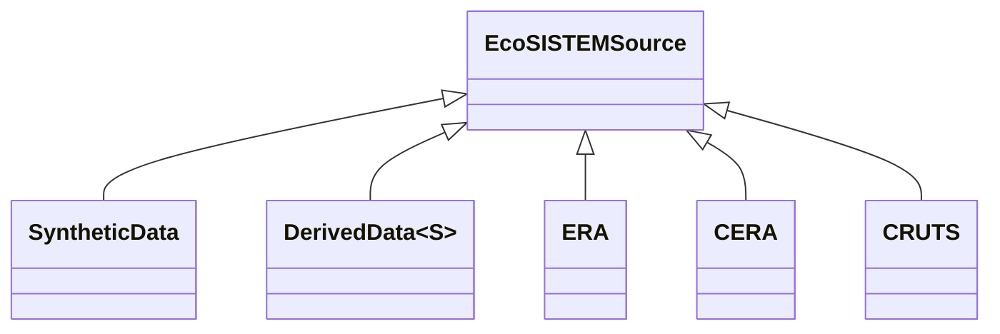
```mermaid
classDiagram
    class DerivedData~S~
    EcoSISTEMSource <|-- SyntheticData
    EcoSISTEMSource <|-- DerivedData
    EcoSISTEMSource <|-- ERA
    EcoSISTEMSource <|-- CERA
    EcoSISTEMSource <|-- CRUTS
```

`SyntheticData` marks values the package generated; `DerivedData{S}` records that a raster was
*computed from* `S` without claiming to be it, which is what keeps a combine's provenance honest.
`ERA`, `CERA` and `CRUTS` name the three netCDF archives the package reads itself - they are
`EcoSISTEMSource` rather than RasterDataSources datasets because those archives are ours to
describe.

Every `EcoSISTEMSource` satisfies the `IsRasterData` trait, which is what admits it to a
`SourceSpec`. Reading one of the three netCDF archives goes through a guard that refuses a third
dimension which is not time, since every reader and plot recipe for them slices by time.

**`AbstractAccumulationPeriod` is what turns a total into a rate.** A monthly precipitation total
is `mm` over *that month*, so converting it to the canonical `mm/day` needs to know how long the
period was - and the three cases are genuinely different: constant for a fixed window,
per-slice where each month has its own length, and per-cell where the period varies spatially
(`gsp`, growing-season precipitation, whose season length `gsl` differs cell by cell).

Which axis a multi-file source stacks on decides whether it is a **time series** or a stack of
unrelated bands: `_stackaxis` returns `Ti` for `WorldClim{Climate}` and `CHELSA{Climate}` (one file
per month) and `Dim{:layer}` for everything else.

## Notes

- **External supertypes:** `AbstractHabitat <: Diversity.AbstractPartition`,
  `StudyGrid <: EcoBase.AbstractGrid`, `SpeciesList <: Diversity.AbstractTypes`,
  `AbstractEcosystem <: Diversity.AbstractMetacommunity`. `AbstractLayer` is deliberately **not** an
  `EcoBase.AbstractGrid`, because a layer is values *on* a grid rather than a grid itself.

- **Canonical units.** Level axes carry a `canonicalunit` that a layer's actual-unit values are
  converted to at build time - temperature `K`, **precipitation `mm/day`** (a rate, not a depth),
  altitude `m`. A `canonicalunit(::Type{<:Role}, ::NicheAxis)` overload gives the `Resource`-role
  form of the same axis where one is defined (`Precipitation` -> `L/day`, `SolarRadiation` -> `kJ/day`).
  `CarbonFlux` is the one **resource-only** axis: it declares `g/day` as a `Resource` and no
  `Condition` unit at all, because NPP is something species consume rather than are matched to.
  Extend the catalogue with `struct MyAxis <: NicheAxis end`.
- **Layer aliases:** `AbstractRegime = AbstractLayer{Condition}`,
  `AbstractSupply = AbstractLayer{Resource}`. `ContinuousRegime`/`CategoricalRegime`/`Supply{A}`
  are `const` aliases over `ContinuousLayer`/`CategoricalLayer`.
- `NicheSuitability` evaluates a `NicheTolerance`'s stored
  `Distributions.ContinuousUnivariateDistribution` (which may be the package's own
  `Trapezoid{T <: Real}`) at the regime value.
- `MPIEcosystem` and the MPI landscape types live in the `EcoSISTEMMPIExt` weak-dependency
  extension.
- **Selected parameter bounds (from the source):**
  `AbstractLayer{R <: Role}`,
  `ContinuousLayer{R <: Role, A <: NicheAxis, V <: Number, Arr <: AbstractArray{V}}`,
  `CategoricalLayer{A <: NicheAxis, V, Arr <: AbstractArray{V}}`,
  `AbstractHabitat{H <: AbstractRegime, B <: AbstractSupply, L <: Union{StudyGrid, Nothing}}`,
  `StudyGrid{C, YD, XD}`, `StudyArea{G <: Union{StudyGrid, Nothing}}`,
  `NicheTolerance{A <: NicheAxis, C, D}` with `ContinuousTolerance{C <: Number}`,
  `EqualPop{U <: Unitful.Units}`,
  `Intervention{S <: AbstractSchedule, R <: AbstractRegion, O <: Tuple}`,
  `ClimateRaster{R <: RasterDataSource, A <: DimensionalData.AbstractDimArray}`,
  `SpeciesList{TL <: AbstractTolerance, DM <: AbstractDemand, MO <: AbstractMovement,
  T <: AbstractTypes, P <: AbstractParams}`.
