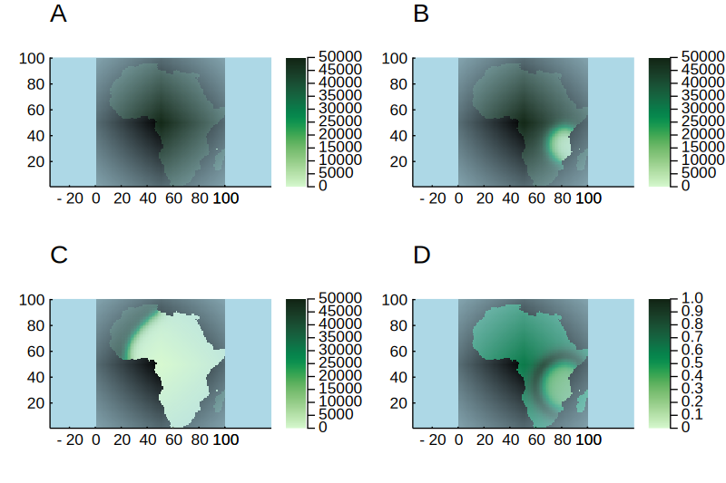

# Virtual plant simulations of Africa

EcoSISTEM was designed to scale to much larger areas, supporting many more species. As an illustrative example, here we simulate up to 50,000 plant species over Africa at an 80km grid scale, with a constant background environment of 25°C. When all species are given an equal fitness in the habitat, all 50,000 can co-exist over long time scales of over 100 years (Figure 2A). This can be run on a workstation with 24 threads in just under 5 hours.

We can also explore the behaviour of selective advantage of specialist species over generalists at these scales. When we introduce a specialist species into an African-sized landscape with an existing generalist, the specialist out-competes the generalist and spreads throughout the continent. The larger the selective advantage of the specialist, the faster it is able to invade and colonise across the landscape (Figure 1). These same dynamics can be seen when we introduce a specialist to the full complement of 50,000 species (Figure 1B-D).

#### SINGLE SPECIES ####

```julia
using EcoSISTEM
using EcoSISTEM.ClimatePref
using EcoSISTEM.Units
using Unitful
using Unitful.DefaultSymbols
using Distances
using StatsBase
using Plots
file = "Africa.tif"
africa = readfile(file, -25°, 50°, -35°, 40°)
active =  Array{Bool, 2}(.!isnan.(africa'))

heatmap(active)

# Set up initial parameters for ecosystem
numSpecies = 1; grid = size(africa); req= 10.0kJ; individuals=0; area = 64e6km^2; totalK = 1000.0kJ/km^2

# Set up how much energy each species consumes
energy_vec = SolarRequirement(fill(req, numSpecies))


# Set rates for birth and death
birth = 0.6/year
death = 0.6/year
longevity = 1.0
survival = 0.0
boost = 1.0
# Collect model parameters together
param = EqualPop(birth, death, longevity, survival, boost)

# Create kernel for movement
kernel = fill(GaussianKernel(15.0km, 10e-10), numSpecies)
movement = AlwaysMovement(kernel, Torus())


# Create species list, including their temperature preferences, seed abundance and native status
opts = fill(274.0K, numSpecies)
vars = fill(0.5K, numSpecies)
traits = GaussTrait(opts, vars)
native = fill(true, numSpecies)
# abun = rand(Multinomial(individuals, numSpecies))
abun = fill(div(individuals, numSpecies), numSpecies)
sppl = SpeciesList(numSpecies, traits, abun, energy_vec,
    movement, param, native)
sppl.params.birth

# Create abiotic environment - even grid of one temperature
abenv = simplehabitatAE(274.0K, grid, totalK, area, active)


# Set relationship between species and environment (gaussian)
rel = Gauss{typeof(1.0K)}()

#Create ecosystem
eco = Ecosystem(sppl, abenv, rel)
rand_start = rand(findall(active), 1)[1]
eco.abundances.grid[1, rand_start[1], rand_start[2]] = 100

# EcoSISTEM Parameters
times = 100years; timestep = 1month; record_interval = 1month; repeats = 1
lensim = length(0years:record_interval:times)
abuns = zeros(Int64, numSpecies, prod(grid), lensim)
@time simulate_record!(abuns, eco, times, record_interval, timestep);

abuns = reshape(abuns[1, :, :, 1], grid[1], grid[2], lensim)

anim = @animate for i in 1:lensim
    africa_abun = Float64.(abuns[:, :, i])
    africa_abun[.!(active)] .= NaN
    heatmap(africa_abun, clim = (0, 700_000), background_color = :lightblue, background_color_outside=:white, grid = false, color = cgrad(:algae, scale = :exp), aspect_ratio = 1)
end
gif(anim, "examples/Biodiversity/Africa.gif", fps = 30)

#### SPECIALIST VERSUS GENERALIST ####

specialist_vars = [0.5K, 1.0K, 5.0K, 10.0K, 25.0K, 50.0K]
velocity = zeros(typeof(1.0km/month), length(specialist_vars))
rand_start = rand(findall(active), 1)[1]
for i in eachindex(specialist_vars)
    # Set up initial parameters for ecosystem
    numSpecies = 2; grid = size(africa); req= 10.0kJ; individuals=0; area = 64e6km^2; totalK = 1000.0kJ/km^2

    # Set up how much energy each species consumes
    energy_vec = SolarRequirement(fill(req, numSpecies))


    # Set rates for birth and death
    birth = 0.6/year
    death = 0.6/year
    longevity = 1.0
    survival = 0.1
    boost = 1.0
    # Collect model parameters together
    param = EqualPop(birth, death, longevity, survival, boost)

    # Create kernel for movement
    kernel = fill(GaussianKernel(15.0km, 10e-10), numSpecies)
    movement = AlwaysMovement(kernel, Torus())


    # Create species list, including their temperature preferences, seed abundance and native status
    opts = fill(274.0K, numSpecies)
    vars = [50.0K, specialist_vars[i]]
    traits = GaussTrait(opts, vars)
    native = fill(true, numSpecies)
    # abun = rand(Multinomial(individuals, numSpecies))
    abun = fill(div(individuals, numSpecies), numSpecies)
    sppl = SpeciesList(numSpecies, traits, abun, energy_vec,
        movement, param, native)
    sppl.params.birth

    # Create abiotic environment - even grid of one temperature
    abenv = simplehabitatAE(274.0K, grid, totalK, area, active)

    # Set relationship between species and environment (gaussian)
    rel = Gauss{typeof(1.0K)}()

    #Create ecosystem
    eco = Ecosystem(sppl, abenv, rel)
    eco.abundances.grid[1, rand_start[1], rand_start[2]] = 100

    # EcoSISTEM Parameters
    burnin = 100years; times = 100years; timestep = 1month; record_interval = 1month; repeats = 1
    lensim = length(0years:record_interval:times)
    simulate!(eco, burnin,timestep)
    eco.abundances.grid[2, rand_start[1], rand_start[2]] = 100
    abuns = zeros(Int64, numSpecies, prod(grid), lensim)
    @time simulate_record!(abuns, eco, times, record_interval, timestep);

    abuns = reshape(abuns[:, :, :, 1], numSpecies, grid[1], grid[2], lensim)
    origin = [rand_start[1], rand_start[2]]
    dest = findall(abuns[2, :, :, 1] .> 0)
    inst_velocity = map(1:lensim) do t
        dest = findall(abuns[2, :, :, t] .> 0)
        dists = [euclidean(origin, [dest[i][1], dest[i][2]]) for i in length(dest)] .* getgridsize(eco)
        return maximum(dists)/month
    end
    velocity[i] = mean(inst_velocity)
end

plot(ustrip.(abs.(specialist_vars .- 50.0K)), ustrip.(velocity),
    xlab = "Selective advantage", ylab = "Invasion speed (km/month)",
    label = "", grid = false)
```

*Figure 1: Invasive capacity of a specialist plant species versus a generalist. Selective advantage is the difference in niche width between the specialist and generalist, and invasion speed is calculated as the average distance travelled per month by the specialist.*
#### ONE SPECIALIST VERSUS MANY GENERALISTS ####
``` julia
using EcoSISTEM
using EcoSISTEM.ClimatePref
using EcoSISTEM.Units
using Unitful
using Unitful.DefaultSymbols
using JLD2
using Printf
file = "Africa.tif"
africa = readfile(file, -25°, 50°, -35°, 40°)
active =  Array{Bool, 2}(.!isnan.(africa'))
# Set up initial parameters for ecosystem
numSpecies = 50_000; grid = size(africa); req= 10.0kJ; individuals=3*10^8; area = 64e6km^2; totalK = 1000.0kJ/km^2

# Set up how much energy each species consumes
energy_vec = SolarRequirement(fill(req, numSpecies))


# Set rates for birth and death
birth = 0.6/year
death = 0.6/year
longevity = 1.0
survival = 0.1
boost = 1.0
# Collect model parameters together
param = EqualPop(birth, death, longevity, survival, boost)

# Create kernel for movement
kernel = fill(GaussianKernel(15.0km, 10e-10), numSpecies)
movement = AlwaysMovement(kernel, Torus())


# Create species list, including their temperature preferences, seed abundance and native status
opts = fill(274.0K, numSpecies)
vars = fill(50.0K, numSpecies)
vars[50_000] = 0.5K
traits = GaussTrait(opts, vars)
native = fill(true, numSpecies)
# abun = rand(Multinomial(individuals, numSpecies))
abun = fill(div(individuals, numSpecies), numSpecies)
sppl = SpeciesList(numSpecies, traits, abun, energy_vec,
    movement, param, native)
sppl.params.birth

# Create abiotic environment - even grid of one temperature
abenv = simplehabitatAE(274.0K, grid, totalK, area, active)


# Set relationship between species and environment (gaussian)
rel = Gauss{typeof(1.0K)}()

#Create ecosystem
eco = Ecosystem(sppl, abenv, rel)
eco.abundances.matrix[50_000, :] .= 0

import EcoSISTEM.simulate!
function simulate!(eco::Ecosystem, times::Unitful.Time, timestep::Unitful.Time, cacheInterval::Unitful.Time, cacheFolder::String, scenario_name::String)
  time_seq = 0s:timestep:times
  counting = 0
  for i in eachindex(time_seq)
      update!(eco, timestep);
      # Save cache of abundances
      if mod(time_seq[i], cacheInterval) == 0year
          @save (joinpath(cacheFolder, scenario_name * (@sprintf "%02d.jld2" uconvert(NoUnits,time_seq[i]/cacheInterval))) abun = eco.abundances.matrix
      end
  end
end

# EcoSISTEM Parameters
burnin = 100years; times = 100years; timestep = 1month; record_interval = 12months;
lensim = length(0years:record_interval:times)
@time simulate!(eco, burnin, timestep)
rand_start = rand(findall(active), 1)[1]
eco.abundances.grid[50_000, rand_start[1], rand_start[2]] = 100
@time simulate!(eco, times, timestep, record_interval, "examples/Biodiversity", "Africa_run");
```

#### 50,000 SPECIES COEXISTING #####

```julia
using EcoSISTEM
using EcoSISTEM.ClimatePref
using EcoSISTEM.Units
using Unitful
using Unitful.DefaultSymbols
using JLD2
using Printf

file = "Africa.tif"
africa = readfile(file, -25°, 50°, -35°, 40°)
active =  Array{Bool, 2}(.!isnan.(africa'))
# Set up initial parameters for ecosystem
numSpecies = 50_000; grid = size(africa); req= 10.0kJ; individuals=3*10^8; area = 64e6km^2; totalK = 1000.0kJ/km^2

# Set up how much energy each species consumes
energy_vec = SolarRequirement(fill(req, numSpecies))


# Set rates for birth and death
birth = 0.6/year
death = 0.6/year
longevity = 1.0
survival = 0.1
boost = 1.0
# Collect model parameters together
param = EqualPop(birth, death, longevity, survival, boost)

# Create kernel for movement
kernel = fill(GaussianKernel(15.0km, 10e-10), numSpecies)
movement = AlwaysMovement(kernel, Torus())


# Create species list, including their temperature preferences, seed abundance and native status
opts = fill(274.0K, numSpecies)
vars = fill(50.0K, numSpecies)
traits = GaussTrait(opts, vars)
native = fill(true, numSpecies)
# abun = rand(Multinomial(individuals, numSpecies))
abun = fill(div(individuals, numSpecies), numSpecies)
sppl = SpeciesList(numSpecies, traits, abun, energy_vec,
    movement, param, native)
sppl.params.birth

# Create abiotic environment - even grid of one temperature
abenv = simplehabitatAE(274.0K, grid, totalK, area, active)


# Set relationship between species and environment (gaussian)
rel = Gauss{typeof(1.0K)}()

#Create ecosystem
eco = Ecosystem(sppl, abenv, rel)

# EcoSISTEM Parameters
burnin = 10years; times = 100years; timestep = 1month; record_interval = 12months;
lensim = length(0years:record_interval:times)
@time simulate!(eco, burnin, timestep)
@time simulate!(eco, times, timestep, record_interval, "examples/Biodiversity", "Africa_run_coexist");

using JLD2
using Plots
using Diversity
abuns = @load "examples/Biodiversity/Africa_run_coexist100.jld2" abun
meta = Metacommunity(abuns)
div = norm_sub_alpha(meta, 0)
sumabuns = reshape(div[!, :diversity], 100, 100)
heatmap(sumabuns,
    background_color = :lightblue,
    background_color_outside=:white,
    grid = false, color = :algae,
    aspect_ratio = 1, layout = (@layout [a b; c d]),
    clim = (0, 50_000), margin = 0.5 * Plots.mm,
    title = "A", titleloc = :left)

abuns = @load "examples/Biodiversity/Africa_run50.jld2" abun
meta = Metacommunity(abuns)
div = norm_sub_alpha(meta, 0)
sumabuns = reshape(div[!, :diversity], 100, 100)
heatmap!(sumabuns,
    background_color = :lightblue,
    background_color_outside=:white,
    grid = false, color = :algae,
    aspect_ratio = 1, subplot = 2,
    clim = (0, 50_000), right_margin = 2.0 * Plots.mm,
    title = "B", titleloc = :left)

abuns = @load "examples/Biodiversity/Africa_run100.jld2" abun
meta = Metacommunity(abuns)
div = norm_sub_alpha(meta, 0)
sumabuns = reshape(div[!, :diversity], 100, 100)
heatmap!(sumabuns,
    background_color = :lightblue,
    background_color_outside=:white,
    grid = false, color = :algae,
    aspect_ratio = 1, subplot = 3,
    clim = (0, 50_000), right_margin = 2.0 * Plots.mm,
    title = "C", titleloc = :left)


abuns = @load "examples/Biodiversity/Africa_run50.jld2" abun
meta = Metacommunity(abuns)
div = norm_sub_rho(meta, 1.0)
sumabuns = reshape(div[!, :diversity], 100, 100)
heatmap!(sumabuns,
    background_color = :lightblue,
    background_color_outside=:white,
    grid = false, color = :algae,
    aspect_ratio = 1, subplot = 4,
     right_margin = 2.0 * Plots.mm,
    title = "D", titleloc = :left, clim = (0, 1))
```


*Figure 2: 100 year simulations of Africa with 50,000 species. (A) Species richness after 100 years of simulation with all species equal. (B) Species richness after 50 years, with one specialist introduced. (C) Species richness after 100 years, with one specialist introduced. (D) Representativeness after 50 years with one specialist introduced (0 is completely unrepresentative of the ecosystem as a whole, 1 is completely representative).*
