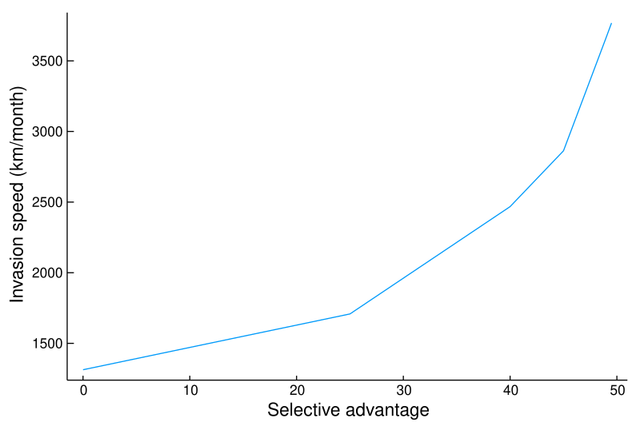
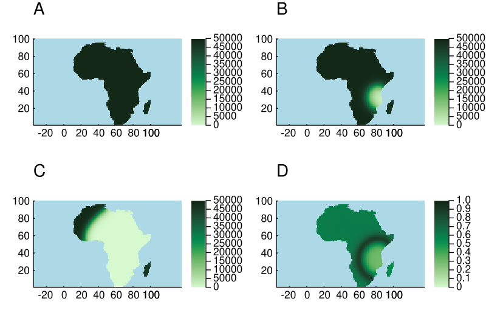

# Virtual plant simulations of Africa

EcoSISTEM was designed to scale to much larger areas, supporting many more species. As an
illustrative example, here we simulate up to 50,000 plant species over Africa, with a constant
background environment. When all species are given an equal fitness in the habitat, all 50,000 can
co-exist over long time scales of over 100 years (Figure 2A). This can be run on a workstation with
24 threads in just under 5 hours.

We can also explore the behaviour of selective advantage of specialist species over generalists at
these scales. When we introduce a specialist species into an African-sized landscape with an
existing generalist, the specialist out-competes the generalist and spreads throughout the
continent. The larger the selective advantage of the specialist, the faster it is able to invade and
colonise across the landscape (Figure 1). These same dynamics can be seen when we introduce a
specialist to the full complement of 50,000 species (Figure 1B-D).

## Running it

The code for these simulations is [`examples/HPC/Africa.jl`](https://github.com/EcoJulia/EcoSISTEM.jl/blob/main/examples/HPC/Africa.jl). It is a script rather than
a listing on this page, and deliberately so: a page of code that nothing runs stops working without
anyone noticing, and this one had — it was still written against builders that were deprecated and
against a geographic grid a simulation now refuses.

```sh
# a smoke test in seconds, at 100 km cells
ECOSISTEM_SCALE=small julia --project=examples examples/HPC/Africa.jl

# the real thing, resolution chosen from the memory available
julia -t 8 --project=examples examples/HPC/Africa.jl

# across MPI ranks, on a cluster
mpiexecjl --project=examples -n 32 julia -t 8 --project=examples examples/HPC/Africa.jl
```

### It chooses its own resolution

The grid is not fixed. [`examples/HPC/memory.jl`](https://github.com/EcoJulia/EcoSISTEM.jl/blob/main/examples/HPC/memory.jl) works out how much memory the run can
allocate — summed across every node when it is launched under MPI — and the script takes the finest
Africa grid that fits, from 100 km down to 5 km. Nothing about the cost is written down:
[`investigate_study_area`](@ref) resolves a candidate grid without building it, and
`EcoSISTEM.getspeciesstorage` says what one species' abundances would occupy on it.

At 50,000 species that spans a few GiB on a laptop to several TiB across HPC nodes, so the same file
serves both. 5 km is multi-node only.

!!! note "Recording is the expensive part"
    At these sizes a *single* recorded timestep can be tens of GiB — more than the run itself holds
    per rank. The script therefore defaults to keeping nothing, with periodic JLD2 or specific dates
    as opt-ins. See [`simulate!`](@ref) and [`simulate_action!`](@ref).



*Figure 1: invasion of a specialist against generalists, and its speed as a function of selective
advantage.*



*Figure 2: 50,000 species coexisting across the continent.*

## Smaller examples of the same machinery

Africa is the scaling demonstration. Each of the pieces it uses is shown on its own, at a size that
runs in seconds, in [`examples/`](https://github.com/EcoJulia/EcoSISTEM.jl/tree/main/examples):

| what | where |
|---|---|
| a fully synthetic ecosystem, no downloads | [`examples/SimulatedEcosystem.jl`](https://github.com/EcoJulia/EcoSISTEM.jl/blob/main/examples/SimulatedEcosystem.jl) |
| real raster + real shapefile coastline | [`examples/ScottishCultivatedLand.jl`](https://github.com/EcoJulia/EcoSISTEM.jl/blob/main/examples/ScottishCultivatedLand.jl) |
| composing layers into a new axis | [`examples/AvailableGround.jl`](https://github.com/EcoJulia/EcoSISTEM.jl/blob/main/examples/AvailableGround.jl) |
| a climate that warms, and one that cycles | [`examples/VaryingClimate.jl`](https://github.com/EcoJulia/EcoSISTEM.jl/blob/main/examples/VaryingClimate.jl) |
| categorical land cover and class-set niches | [`examples/CategoricalLandCover.jl`](https://github.com/EcoJulia/EcoSISTEM.jl/blob/main/examples/CategoricalLandCover.jl) |
| the same ecology under five landscapes | [`examples/landscapes.jl`](https://github.com/EcoJulia/EcoSISTEM.jl/blob/main/examples/landscapes.jl) |
| climate change, habitat loss and invasion | [`examples/interventions.jl`](https://github.com/EcoJulia/EcoSISTEM.jl/blob/main/examples/interventions.jl) |

For an interactive version you can drive from a browser, see the
[`notebooks/InteractiveAfrica.jl`](https://github.com/EcoJulia/EcoSISTEM.jl/blob/main/notebooks/InteractiveAfrica.jl) Pluto notebook, which runs a much smaller Africa and
lets you move the species' temperature preference with a slider.
