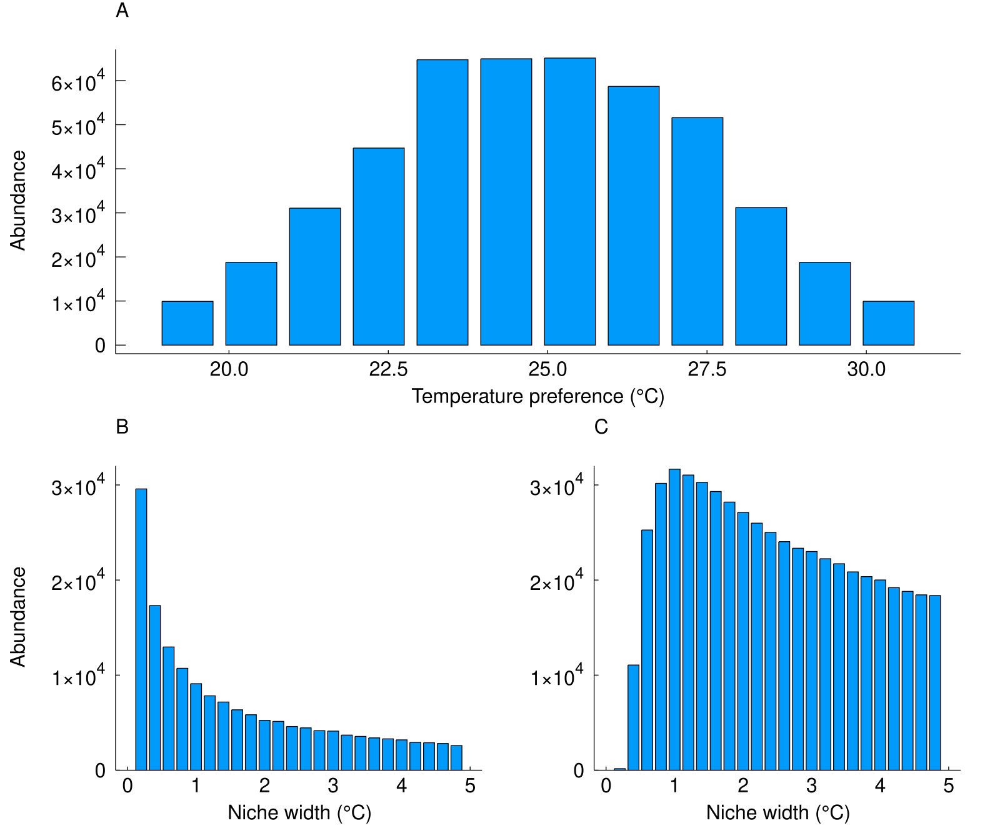
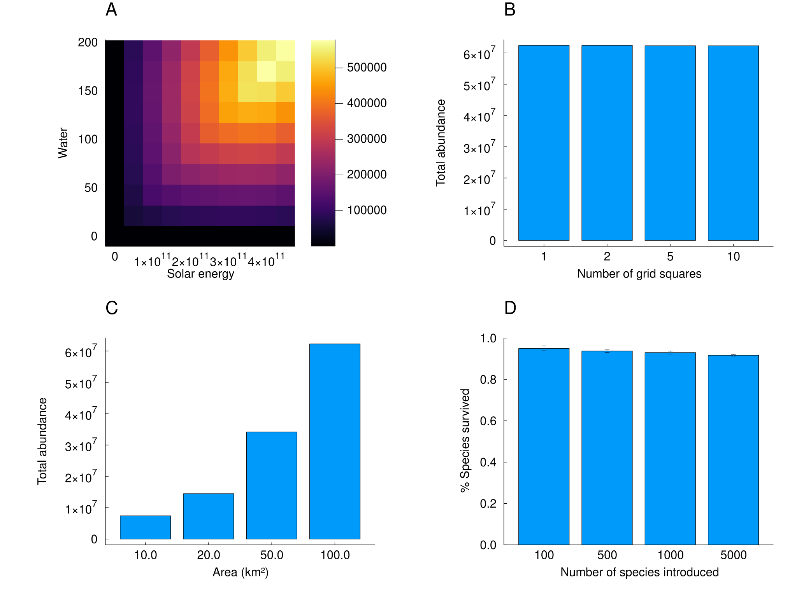
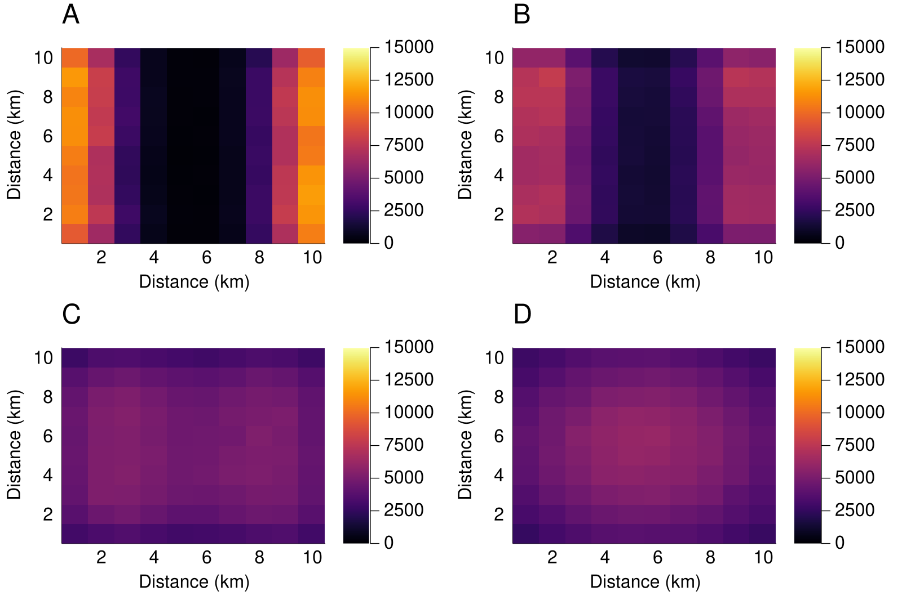

```@meta
CurrentModule = EcoSISTEM
```

# Examples

A model of this kind is worth trusting only if it reproduces things already known about
ecosystems. This page works through several of them:

- species are commonest where the environment suits them;
- specialists beat generalists where conditions are constant, but not where they are not;
- more resource supports more individuals;
- total abundance depends on the *area* of a landscape, not on how finely it is divided into
  cells;
- species with longer dispersal spread further;
- large pools of species coexist.

Every result below is produced by the code shown, on a small landscape that runs in seconds.
The figures come from the same experiments at full scale - hundreds of species over decades of
simulated time - and those are asserted as tests in `examples/biodiversity.jl`.

## The setup

One helper builds a uniform landscape, another puts a community on it. Both are ordinary calls
to [`GridHabitat`](@ref), [`build_species`](@ref) and [`build_ecosystem`](@ref):

```@example examples
using EcoSISTEM, EcoSISTEM.Units
using Unitful, Unitful.DefaultSymbols

const SOLAR = 4.5e11kJ / (km^2 * day)          # supplied per unit area, per day
const WATER = 192.0mm / day
const NEEDS = (sunlight = 450000.0kJ / day,    # consumed per individual, per day
               water = 192.0Unitful.L / day)

# A `cells × cells` grid over a square landscape of side `side`, uniform in every respect.
# `topology` says how the grid's edges join, and it is an **environment** keyword: whether the
# world wraps is a property of the map, not of the species dispersing over it.
function uniform_env(cells, side; temperature = 298.0K, topology = Torus())
    area = StudyArea(extent = (side, side), cellsize = side / cells,
                     verbosity = :silent)
    return GridHabitat(regime = UniformSpec(temperature,
                                                  axis = Temperature),
                             supply = (sunlight = UniformSpec(SOLAR,
                                                              axis = SolarRadiation),
                                       water = UniformSpec(WATER,
                                                           axis = Precipitation)),
                             area = area, topology = topology)
end

# A community of `length(opts)` species, with the given temperature optima and niche widths.
function community(env, opts, widths; dispersal = 2.4km,
                   individuals = 10_000_000)
    species = build_species(length(opts), tolerance = (opts, widths), toleranceaxis = Temperature,
                            demand = NEEDS, demandaxis = (sunlight = SolarRadiation, water = Precipitation), dispersal = dispersal,
                            birth = 0.15 / year,
                            death = 0.15 / year, survival = 0.1,
                            abundance = individuals, seed = 20260805)
    return build_ecosystem(species, env; seed = 20260805)
end

# Run, and report the total abundance of each species across the whole landscape.
function run_totals(eco; times = 5year)
    simulate!(eco, times, 1month_mean_duration)
    return vec(sum(eco.abundances.matrix, dims = 2))
end
nothing # hide
```

Both builders take a `seed`, which fixes one random stream per species - so every number on
this page is reproducible, and independent of how many threads the simulation used.

## Niche preference

Fifty species differing only in the temperature they prefer, spread either side of the
landscape's own 298 K. The species matched to the environment should end up commonest:

```@example examples
n = 50
widths = fill(2.0K, n)
opts = 298.0K .+ widths .* range(-3, stop = 3, length = n)

abundance = run_totals(community(uniform_env(10, 10.0km), opts, widths))

(matched = sum(abundance[(opts .>= 298.0K) .& (opts .< 299.0K)]),
 cold = sum(abundance[(opts .>= 292.0K) .& (opts .< 293.0K)]),
 warm = sum(abundance[(opts .>= 303.0K) .& (opts .< 304.0K)]))
```

The species whose optimum sits on the landscape's temperature are the most abundant, and
abundance falls away in both directions.

## Niche width

Now every species prefers exactly the landscape's temperature, and they differ only in how
broad a range they tolerate. In a landscape that never varies, a wide niche buys nothing, so
the specialists should win:

```@example examples
widths = collect(range(0.05K, stop = 5.0K, length = n))
opts = fill(298.0K, n)

abundance = run_totals(community(uniform_env(10, 10.0km), opts, widths))
(narrowest = sum(abundance[1:10]), widest = sum(abundance[(end - 9):end]))
```

That advantage belongs to the *constant* landscape rather than to specialism as such. Where
the environment sits away from every species' optimum, the narrowest species are excluded by
the mismatch while the widest are still too diffuse, and the advantage moves to intermediate
widths.



*At full scale: (A) abundance against niche optimum, commonest at the environment's own
temperature; (B) abundance against niche width in a matched environment, favouring
specialists; (C) the same after a 1 °C shift, where intermediate widths win.*

## Resources

Supply is given per unit area, so a cell's resource is that rate times its area, and a
species' demand is per individual. A cell supports more individuals when it is given more -
here a solar supply graded from quarter strength in the west to full strength in the east:

```@example examples
env = uniform_env(10, 10.0km)
full = env.supply.sunlight.matrix[1, 1]
for (j, fraction) in enumerate(range(0.25, stop = 1.0, length = 10))
    env.supply.sunlight.matrix[:, j] .= fraction * full
end

eco = community(env, fill(298.0K, n), fill(2.0K, n))
simulate!(eco, 5year, 1month_mean_duration)
percell = reshape(sum(eco.abundances.matrix, dims = 1), (10, 10))
(west = sum(percell[:, 1]), east = sum(percell[:, end]))
```

The two resources combine by Liebig's law of the minimum - the scarcer one sets the outcome -
so grading *both* at once would compare cells each limited by whichever happened to be scarcer
there, and would say nothing about either.

## Area and grid resolution

Total abundance is a property of the landscape, not of the mesh laid over it. The same 100 km^2
divided into 1, 4, 25 or 100 cells supports the same number of individuals:

```@example examples
opts, widths = fill(298.0K, n), fill(2.0K, n)
map([1, 2, 5, 10]) do cells
    sum(run_totals(community(uniform_env(cells, 10.0km;
                                             topology = Island()),
                             opts, widths)))
end
```

Make the landscape itself larger and it carries more resource, and so supports more
individuals:

```@example examples
map([5.0km, 10.0km, 20.0km]) do side
    sum(run_totals(community(uniform_env(10, side;
                                             topology = Island()),
                             opts, widths)))
end
```



*At full scale: (A) abundance across a landscape with graded water and solar supply;
(B) abundance against landscape area; (C) abundance against grid resolution; (D) percentage of
species surviving ten years.*

## Dispersal

Species with a longer mean dispersal distance spread further and faster. Seeding two species
on opposite edges of a landscape with no wrap-around boundary, and running for fifty years, a
wider kernel drains the edges and fills the middle: the edge columns fall as the kernel widens
while the centre column rises.



*Total abundance of two species seeded at opposite edges, after simulation, for mean dispersal
distances of (A) 0.5 km, (B) 1 km, (C) 2 km and (D) 4 km.*

By default a boundary redistributes rather than removes: an individual whose dispersal is aimed
off the grid, or into an inactive cell, is reallocated among the destinations it *can* reach, so
no boundary loses individuals. Pass `disperse_safely = false` to any of [`Torus`](@ref),
[`Cylinder`](@ref) or [`Island`](@ref) - as `Torus(false)` - to make those individuals die
instead, which is the difference between an animal-dispersed seed, carried somewhere the animal
can reach, and a wind-dispersed one blown out to sea. Because it is about dead cells rather than
the map edge, it matters for a torus too, which has no edge but may still contain inactive cells.

## Large species pools

Coexistence here is not an artefact of every species being identical. With randomised niche
widths, optima, dispersal distances, mortality rates and body sizes, at least 90% of the pool
survives - and it keeps doing so as the pool grows from 50 species to 500.
